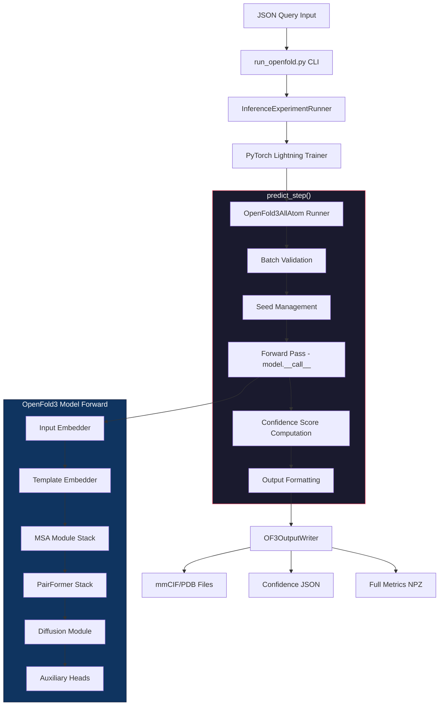
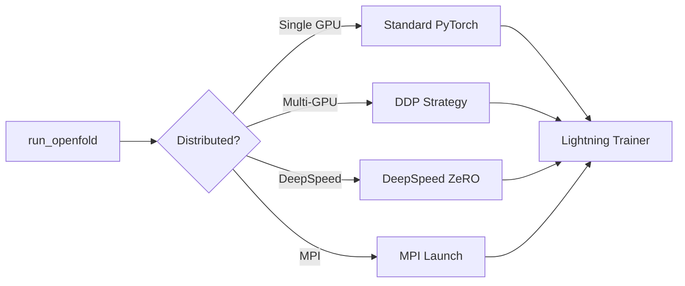

# OpenFold3 Inference Pipeline

## High-Level Flow



## Entry Points

| Dosya | Boyut | Rol |
|-------|-------|-----|
| `run_openfold.py` | 7.6 KB | CLI giriş noktası (Click) |
| `entry_points/experiment_runner.py` | 32.7 KB | Training/Inference orkestrasyon |
| `entry_points/validator.py` | 18.7 KB | Pydantic tabanlı input validation |
| `of3_all_atom/runner.py` | 36.9 KB | Inference execution |
| `of3_all_atom/model.py` | 29 KB | Ana model mimarisi |

## CLI Commands

```bash
# Inference
run_openfold predict --query_json=query.json

# MSA Alignment
run_openfold align-msa --query_json=query.json

# Training
run_openfold train --config=config.yaml
```

## Distributed Inference



## Input Format

```json
{
  "queries": {
    "protein_name": {
      "chains": [
        {
          "molecule_type": "protein",
          "chain_ids": ["A"],
          "sequence": "MQIFVKTLTGK..."
        }
      ]
    }
  }
}
```

**Desteklenen Molekül Tipleri:**
- Protein (tek/multi-chain)
- DNA
- RNA
- Small molecules / Ligands
- PTM (post-translational modifications)

## Output Structure

```
output_dir/
├── query_id/
│   ├── seed_0/
│   │   ├── sample_0/
│   │   │   ├── prediction.cif      # mmCIF yapı dosyası
│   │   │   ├── confidence.json     # pLDDT, PAE, pDE, pTM
│   │   │   └── full_confidence.npz # Tam matrisler
│   │   └── sample_1/
│   └── seed_1/
```

## Related
- [[02-model-architecture]] - Model iç mimarisi
- [[03-data-flow]] - Detaylı veri akışı
- [[../modules/prediction-heads]] - Confidence metrikleri

#openfold3 #inference #pipeline
