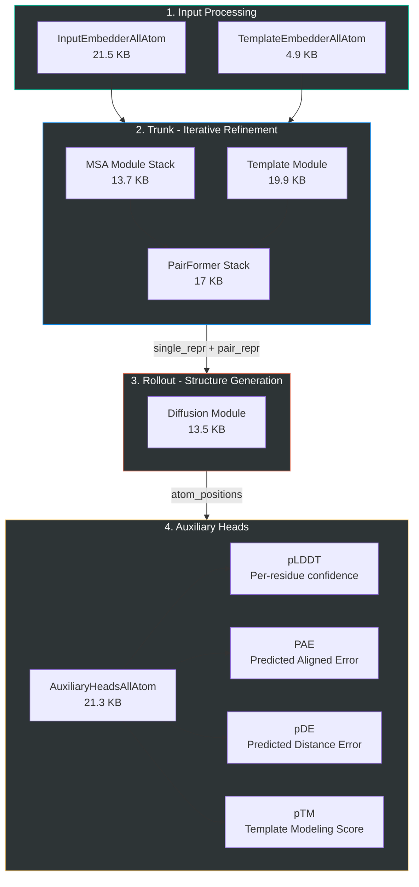
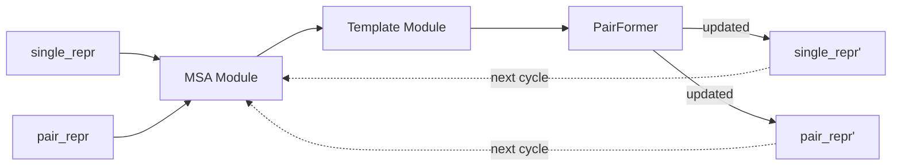

# OpenFold3 Model Architecture

## Overview

OpenFold3, AlphaFold3'ün açık kaynak replikasyonudur. Diffusion tabanlı all-atom yapı tahmini yapar.

## Architecture Diagram



## Processing Stages

### Stage 1: Input Embedding
- **InputEmbedderAllAtom** - Raw sequence, atom features, residue features
- **TemplateEmbedderAllAtom** - Structural template bilgileri (eğer varsa)
- Çıktı: `single_repr` (N x d_single) + `pair_repr` (N x N x d_pair)

### Stage 2: Trunk (Iterative)
Trunk birden fazla cycle döner:



### Stage 3: Diffusion Rollout
- İteratif noise → structure denoising
- Her adımda atom pozisyonları refine edilir
- **DiffusionTransformer** + **DiffusionConditioning** katmanları

### Stage 4: Auxiliary Heads
- Confidence metrikleri hesaplanır
- [[../modules/prediction-heads]] detaylı bilgi

## Core Layer Primitives

| Layer | Dosya | Açıklama |
|-------|-------|----------|
| Attention (Pair Bias) | `attention_pair_bias.py` | Pair representation ile bias edilmiş attention |
| Triangular Attention | `triangular_attention.py` | Üçgen güncelleme ile attention |
| Triangular Multiplicative | `triangular_multiplicative_update.py` | Outgoing/incoming triangular update |
| Outer Product Mean | `outer_product_mean.py` | MSA → pair projection |
| Sequence Local Atom Attn | `sequence_local_atom_attention.py` | Atom seviyesinde lokal attention |
| Diffusion Transformer | `diffusion_transformer.py` | Diffusion step transformer |
| Diffusion Conditioning | `diffusion_conditioning.py` | Noise schedule conditioning |
| Transition | `transition.py` | Feed-forward transition layers |

## Primitive Building Blocks

```
core/model/primitives/
├── attention.py       (26 KB)  # Multi-head attention variants
├── linear.py          (5 KB)   # Custom linear layers
├── normalization.py   (4.3 KB) # LayerNorm variants
├── activations.py     (1.9 KB) # SiLU, GELU etc.
├── dropout.py         (2.4 KB) # Structured dropout
└── initialization.py  (2.2 KB) # Weight init schemes
```

## Latent Module Details

```
core/model/latent/
├── base_blocks.py     (17.3 KB) # Temel transformer blokları
├── base_stacks.py     (10.2 KB) # Stack kompozisyonları
├── evoformer.py       (12.8 KB) # Evoformer (sequence evolution)
├── msa_module.py      (13.7 KB) # MSA processing
├── pairformer.py      (17 KB)   # Pair transformations
└── template_module.py (20 KB)   # Template integration
```

## Related
- [[01-openfold3-inference-pipeline]] - Pipeline genel görünüm
- [[03-data-flow]] - Veri akışı detayları
- [[../modules/diffusion-module]] - Diffusion detayları

#openfold3 #architecture #model
