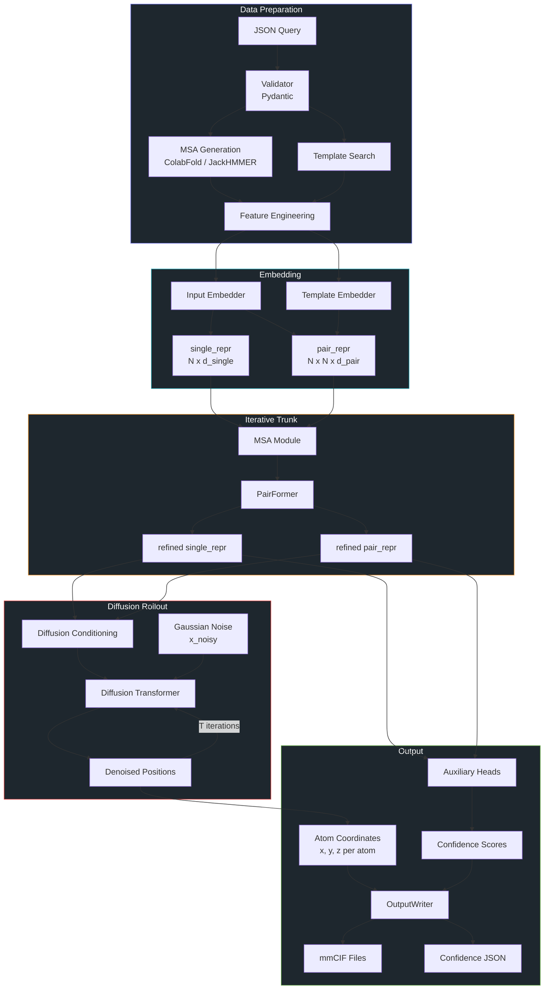
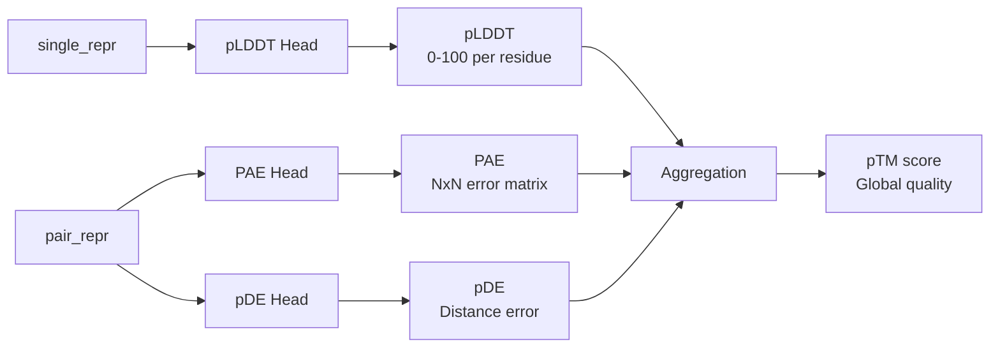

# OpenFold3 Data Flow

## End-to-End Data Pipeline



## Tensor Shapes (Approximate)

| Tensor | Shape | Açıklama |
|--------|-------|----------|
| `single_repr` | `[B, N_tokens, d_single]` | Per-token representation |
| `pair_repr` | `[B, N_tokens, N_tokens, d_pair]` | Pairwise feature map |
| `msa_repr` | `[B, N_msa, N_tokens, d_msa]` | MSA sequence embeddings |
| `atom_positions` | `[B, N_atoms, 3]` | 3D koordinatlar |
| `plddt_logits` | `[B, N_tokens, n_bins]` | Per-residue confidence |
| `pae_logits` | `[B, N_tokens, N_tokens, n_bins]` | Aligned error map |

## Data Processing Pipeline

```
core/data/
├── framework/     # Temel soyutlamalar
├── io/            # Dosya I/O (mmCIF, PDB parse)
├── pipelines/     # Processing zinciri
├── primitives/    # Veri yapıları (Feature types)
├── resources/     # Harici veri kaynakları (CCD, templates)
└── tools/         # Yardımcı fonksiyonlar
```

## Confidence Score Computation



### Confidence Metrikleri

| Metrik | Açıklama | Kullanım |
|--------|----------|----------|
| **pLDDT** | Per-residue local distance difference test | Lokal yapı güvenilirliği |
| **PAE** | Predicted Aligned Error | Domain-domain ilişki güvenilirliği |
| **pDE** | Predicted Distance Error | Mesafe tahmin hatası |
| **pTM** | Predicted Template Modeling | Global yapı kalitesi |

## Memory Optimization

- **Activation Checkpointing**: Trunk iterasyonlarında bellek tasarrufu
- **Chunked Confidence**: Büyük atom sayılarında parçalı hesaplama
- **Selective Offloading**: GPU ↔ CPU transfer
- **DeepSpeed ZeRO**: Multi-GPU bellek optimizasyonu

## Related
- [[01-openfold3-inference-pipeline]] - Pipeline overview
- [[02-model-architecture]] - Model detayları

#openfold3 #data-flow #tensors
