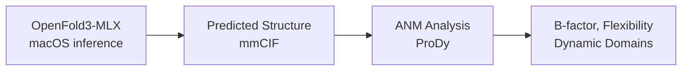

# OpenFold3-MLX (Apple Silicon Fork)

## Overview
OpenFold3'ün Apple Silicon (M1/M2/M3/M4) için optimize edilmiş MLX fork'u.

**Repo:** https://github.com/latent-spacecraft/openfold-3-mlx
**Lokal:** `openfold3-mlx/`

## Neden MLX?
- macOS'ta CUDA yok → MLX native Apple Silicon desteği
- Unified memory architecture → veri hareketi overhead'i yok
- Neural Engine'den faydalanma
- Pil ile çalışırken bile araştırma kalitesinde tahmin

## Original vs MLX Karşılaştırma

| Özellik | Original (CUDA) | MLX Fork |
|---------|-----------------|----------|
| GPU | NVIDIA CUDA | Apple Silicon |
| Memory | Dedicated VRAM | Unified Memory |
| OS | Linux | macOS |
| Performance | Yüksek (A100/H100) | İyi (M4 Pro/Max) |
| Accuracy | pLDDT 85+ | pLDDT 85+ (aynı) |

## Performance Benchmarks

| Donanım | Protein | Süre | pLDDT |
|---------|---------|------|-------|
| MacBook Air M4 | 238aa (GFP) | ~2:45 | 85-86 |
| MacBook Air M4 | 30aa (peptide) | ~23s | 54-55 |
| Mac Studio/Pro | 238aa (GFP) | ~33s | 85+ |

## MLX-Specific Optimizations
- **MLX Attention**: Native Apple Silicon attention implementation
- **MLX Triangle Kernels**: Triangular attention/multiplication
- **MLX Activations**: Hardware-accelerated activation functions
- **Parallel Data Loading**: Multi-worker preprocessing
- **Memory Patterns**: Unified memory model için optimize

## Kurulum

```bash
cd openfold3-mlx
chmod +x ./install.sh && ./install.sh
# veya
pip install -e .
setup_openfold  # Model weights indirme
```

## Gereksinimler
- macOS 12.0+ (Monterey)
- Apple Silicon (M1+)
- Python 3.10+
- 16GB+ unified memory (8GB minimum)
- ~10GB disk (model weights)

## Inference

```bash
# Basit protein tahmini
./predict.sh 'MSKGEELFTGVVPILVELDGDVNGHK...'

# JSON input ile
python openfold3/run_openfold.py predict \
    --query_json examples/example_inference_inputs/query_real.json \
    --runner_yaml examples/example_runner_yamls/mlx_runner.yml
```

## Dosya Yapısı Farkları

```
openfold3-mlx/
├── install.sh          # macOS installer script
├── predict.sh          # Quick prediction script
├── setup.py            # MLX-specific setup
├── openfold3/
│   ├── core/
│   │   ├── model/
│   │   │   ├── layers/     # MLX-optimized layers
│   │   │   └── primitives/ # MLX attention, linear etc.
│   │   └── kernels/        # MLX triangle kernels
│   └── ...
└── examples/
    └── example_runner_yamls/
        └── mlx_runner.yml  # MLX-specific config
```

## Bu Projede Kullanım Planı



macOS'ta inference için MLX fork, analiz için ProDy/BioPython kullanacağız.

## Related
- [[01-openfold3-inference-pipeline]] - Original pipeline
- [[02-model-architecture]] - Model architecture (aynı)
- [[../setup/conda-setup]] - Conda environment

#openfold3 #mlx #apple-silicon #macos
