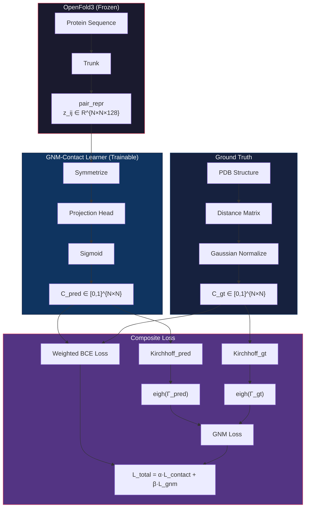
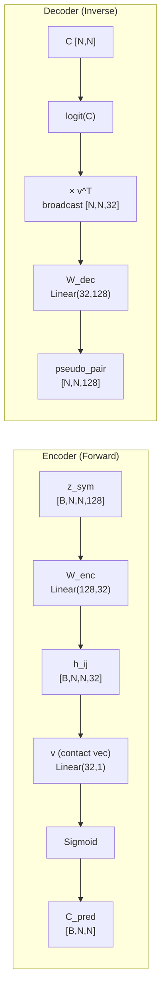
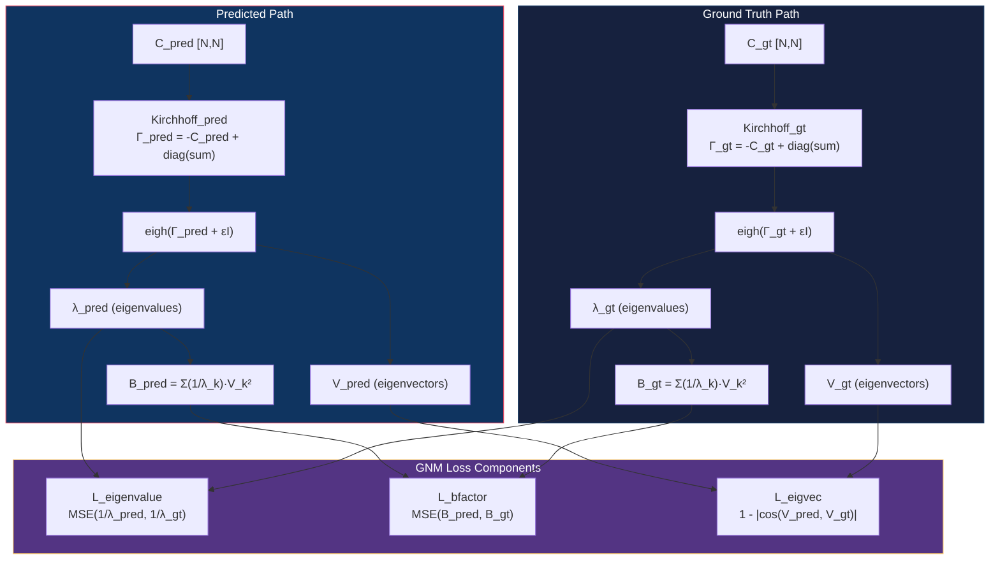
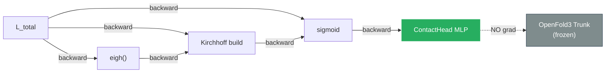
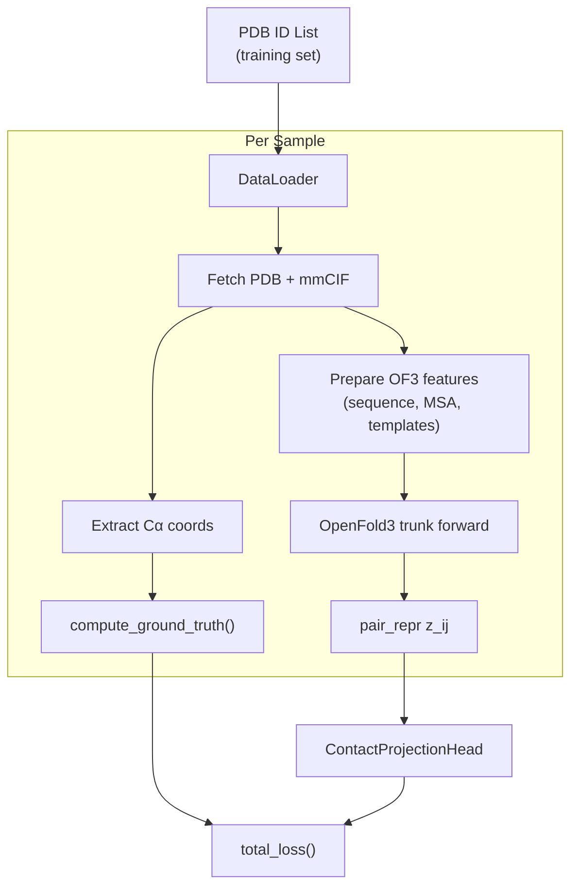

# GNM-Contact Learner: Pair Representation → Learned Connectivity Matrix

## 1. Problem Statement

OpenFold3'ün trunk'ından çıkan **pair representation** `z_ij ∈ R^{N×N×128}` içinde yapısal bilgi gömülü. Bu bilgiyi kullanarak:

1. Bir **olasılıksal connectivity matrisi** `C_pred ∈ [0,1]^{N×N}` öğrenmek
2. Ground truth PDB yapısından elde edilen **normalize contact map** `C_gt ∈ [0,1]^{N×N}` ile karşılaştırmak
3. Her iki taraftaki **Kirchhoff matrisi → GNM metrikleri** (eigenvalues, B-factors) arasındaki farkı minimize etmek



---

## 2. Architecture Details

### 2.1 Input: Pair Representation

```
Source: OpenFold3 trunk output
Shape:  [B, N_token, N_token, C_z]    # C_z = 128
Type:   torch.float32
Status: FROZEN (no gradient)
```

**Extraction Point:** `of3_all_atom/model.py → run_trunk() → return (s_input, s, z)`

```python
# Pseudo-code: Hook into trunk output
with torch.no_grad():
    s_input, s, z = model.run_trunk(batch)
    pair_repr = z  # [B, N, N, 128]
```

### 2.2 Symmetrization

Pair representation simetrik değil: `z_ij ≠ z_ji`. Contact map simetrik olmalı.

```python
# Symmetrize
z_sym = 0.5 * (z + z.transpose(-2, -3))  # [B, N, N, 128]
```

### 2.3 Projection Head (Trainable) — Invertible Bottleneck

**Tasarım kararı:** İleride koordinattan pairwise representation üretmek istiyoruz (inverse path). Bu nedenle encoder-decoder bottleneck mimarisi kullanıyoruz.



**Boyutlar:**
- `W_enc ∈ R^{128×32}` — pair space → bottleneck (4,096 params)
- `v ∈ R^{32}` — bottleneck → contact scalar (32 params)
- `W_dec ∈ R^{32×128}` — bottleneck → pair space (4,096 params, inverse path)
- **Toplam: ~8,224 parametre**

**Forward path (training):**
```
z_ij [128] → W_enc → h_ij [32] → dot(v) → logit → sigmoid → C_pred
```

**Inverse path (inference, sonra kullanım):**
```
coords → dist → C_gt → logit(C_gt) → broadcast × v^T → [32] → W_dec → pseudo_pair [128]
```

### 2.4 Ground Truth: Normalized Contact Map

Ground truth contact map'i 0-1 arası **sürekli** olarak normalize ediyoruz (binary değil):

```python
# Ground truth: Gaussian soft contact map
def compute_gt_contact_map(coords_ca, r_cut=10.0, sigma=2.0):
    """
    coords_ca: [N, 3] Cα coordinates from PDB
    Returns:   [N, N] soft contact map in [0, 1]
    """
    dist = torch.cdist(coords_ca, coords_ca)  # [N, N]

    # Gaussian decay: 1.0 at dist=0, ~0.5 at dist=r_cut
    C_gt = torch.exp(-0.5 * ((dist / sigma) ** 2))

    # Self-contact = 0 (diagonal)
    C_gt.fill_diagonal_(0.0)

    return C_gt  # [N, N], values in (0, 1)
```

**Alternatif normalizasyon:**

| Yöntem | Formül | Avantaj |
|--------|--------|---------|
| Gaussian | `exp(-d²/2σ²)` | Smooth gradient, fiziksel |
| Sigmoid cutoff | `σ(-(d - r_c)/τ)` | Sharp cutoff, GNM'e yakın |
| Min-max | `1 - (d - d_min)/(d_max - d_min)` | Basit, ama gradient zayıf |
| **Önerilen: Sigmoid** | `σ(-(d - r_c)/τ)` | GNM Kirchhoff ile uyumlu |

**Sigmoid cutoff detay:**
```python
def sigmoid_contact(dist, r_cut=10.0, tau=1.0):
    """Differentiable approximation to hard cutoff."""
    return torch.sigmoid(-(dist - r_cut) / tau)
```

---

## 3. Loss Function

### 3.1 Contact Loss (L_contact)

```python
def contact_loss(C_pred, C_gt, seq_sep_min=6):
    """
    Weighted BCE with sequence separation filter.

    C_pred: [B, N, N] predicted probabilities
    C_gt:   [B, N, N] ground truth soft contacts
    """
    N = C_pred.shape[-1]

    # Sequence separation mask: |i-j| >= seq_sep_min
    idx = torch.arange(N, device=C_pred.device)
    sep_mask = (idx.unsqueeze(0) - idx.unsqueeze(1)).abs() >= seq_sep_min

    # Class imbalance weighting
    # Contact pairs are rare (~3%), upweight them
    n_contact = C_gt[sep_mask].sum()
    n_total = sep_mask.sum()
    pos_weight = (n_total - n_contact) / (n_contact + 1e-8)

    # Weighted BCE
    loss = F.binary_cross_entropy(
        C_pred[sep_mask],
        C_gt[sep_mask],
        weight=None,  # OR use pos_weight for focal-like behavior
    )

    return loss
```

### 3.2 GNM Loss (L_gnm) - Differentiable Kirchhoff

Bu loss, **hem predicted hem ground truth** connectivity matrisinden Kirchhoff matrisi oluşturup, GNM eigendecomposition ile elde edilen metrikleri karşılaştırır.



```python
def differentiable_kirchhoff(C, eps=1e-6):
    """
    Build Kirchhoff matrix from soft contact matrix.

    C: [N, N] contact probabilities in [0, 1]
    Returns: Γ [N, N] Kirchhoff matrix (real symmetric, PSD)
    """
    # Off-diagonal: negative contact strength
    Gamma = -C.clone()
    Gamma.fill_diagonal_(0.0)

    # Diagonal: coordination number (sum of contacts)
    Gamma.diagonal().copy_(C.sum(dim=-1))

    # Regularize for numerical stability
    Gamma = Gamma + eps * torch.eye(C.shape[-1], device=C.device)

    return Gamma


def gnm_decompose(Gamma, n_modes=20):
    """
    Differentiable GNM eigendecomposition.

    Gamma: [N, N] Kirchhoff matrix
    n_modes: number of non-trivial modes to use

    Returns:
        eigenvalues: [n_modes] non-trivial eigenvalues (ascending, skip first)
        eigenvectors: [N, n_modes] corresponding eigenvectors
        b_factors: [N] predicted B-factors
    """
    # Symmetric eigendecomposition (differentiable!)
    eigenvalues, eigenvectors = torch.linalg.eigh(Gamma)

    # Skip trivial zero mode (index 0, smallest eigenvalue)
    # Take first n_modes non-trivial modes
    eig_vals = eigenvalues[1:n_modes+1]          # [n_modes]
    eig_vecs = eigenvectors[:, 1:n_modes+1]      # [N, n_modes]

    # B-factors: B_i = Σ_k (V_ik² / λ_k)
    inv_eig = 1.0 / (eig_vals + 1e-10)           # [n_modes]
    b_factors = (eig_vecs ** 2 @ inv_eig)         # [N]

    return eig_vals, eig_vecs, b_factors


def gnm_loss(C_pred, C_gt, n_modes=20,
             w_eigenvalue=1.0, w_bfactor=1.0, w_eigvec=0.5):
    """
    GNM-based physics loss.

    Compares Kirchhoff eigendecomposition from both sides.
    """
    # Build Kirchhoff matrices
    Gamma_pred = differentiable_kirchhoff(C_pred)
    Gamma_gt = differentiable_kirchhoff(C_gt)

    # Decompose
    eig_pred, vec_pred, bf_pred = gnm_decompose(Gamma_pred, n_modes)
    eig_gt, vec_gt, bf_gt = gnm_decompose(Gamma_gt, n_modes)

    # L_eigenvalue: Compare inverse eigenvalues (B-factor scale)
    inv_pred = 1.0 / (eig_pred + 1e-10)
    inv_gt = 1.0 / (eig_gt + 1e-10)
    # Normalize to make scale-invariant
    inv_pred_norm = inv_pred / (inv_pred.sum() + 1e-10)
    inv_gt_norm = inv_gt / (inv_gt.sum() + 1e-10)
    L_eigenvalue = F.mse_loss(inv_pred_norm, inv_gt_norm)

    # L_bfactor: Compare B-factor profiles
    bf_pred_norm = bf_pred / (bf_pred.max() + 1e-10)
    bf_gt_norm = bf_gt / (bf_gt.max() + 1e-10)
    L_bfactor = F.mse_loss(bf_pred_norm, bf_gt_norm)

    # L_eigvec: Cosine similarity (phase-invariant) for top modes
    # |cos(v_pred, v_gt)| handles sign ambiguity
    cos_sim = torch.abs(F.cosine_similarity(
        vec_pred.T, vec_gt.T, dim=-1
    ))  # [n_modes]
    L_eigvec = (1.0 - cos_sim).mean()

    L_gnm = (w_eigenvalue * L_eigenvalue +
             w_bfactor * L_bfactor +
             w_eigvec * L_eigvec)

    return L_gnm, {
        'L_eigenvalue': L_eigenvalue.item(),
        'L_bfactor': L_bfactor.item(),
        'L_eigvec': L_eigvec.item(),
    }
```

### 3.3 Total Loss

```python
def total_loss(C_pred, C_gt, alpha=1.0, beta=0.5):
    """
    L_total = α · L_contact + β · L_gnm
    """
    L_contact = contact_loss(C_pred, C_gt)
    L_gnm, gnm_details = gnm_loss(C_pred, C_gt)

    L_total = alpha * L_contact + beta * L_gnm

    return L_total, {
        'L_contact': L_contact.item(),
        'L_gnm': L_gnm.item(),
        **gnm_details,
    }
```

---

## 4. Complete Pseudo-Code

```python
# ═══════════════════════════════════════════════════
#  GNM-Contact Learner - Full Training Pipeline
# ═══════════════════════════════════════════════════

import torch
import torch.nn as nn
import torch.nn.functional as F


# ─── MODEL ────────────────────────────────────────

class ContactProjectionHead(nn.Module):
    """Learnable projection: pair_repr → contact probability."""

    def __init__(self, c_z=128, hidden_dims=[64, 32]):
        super().__init__()
        layers = []
        in_dim = c_z
        for h_dim in hidden_dims:
            layers.extend([
                nn.Linear(in_dim, h_dim),
                nn.LayerNorm(h_dim),
                nn.SiLU(),
            ])
            in_dim = h_dim
        layers.append(nn.Linear(in_dim, 1))
        self.mlp = nn.Sequential(*layers)

    def forward(self, z):
        """
        z: [B, N, N, C_z] pair representation
        Returns: [B, N, N] contact probabilities
        """
        # Symmetrize
        z_sym = 0.5 * (z + z.transpose(1, 2))

        # Project to scalar
        logits = self.mlp(z_sym).squeeze(-1)  # [B, N, N]

        # Symmetrize logits (enforce symmetry after projection)
        logits = 0.5 * (logits + logits.transpose(-1, -2))

        # Zero diagonal (no self-contact)
        mask = ~torch.eye(logits.shape[-1], dtype=torch.bool,
                         device=logits.device)
        logits = logits * mask

        # Sigmoid → probability
        C_pred = torch.sigmoid(logits)

        return C_pred


class GNMContactLearner(nn.Module):
    """Full model: OpenFold3 (frozen) + Contact Head (trainable)."""

    def __init__(self, openfold_model, c_z=128):
        super().__init__()

        # Freeze OpenFold3
        self.openfold = openfold_model
        for param in self.openfold.parameters():
            param.requires_grad_(False)
        self.openfold.eval()

        # Trainable head
        self.contact_head = ContactProjectionHead(c_z=c_z)

    def forward(self, batch):
        """
        Returns:
            C_pred: [B, N, N] predicted contact probabilities
            pair_repr: [B, N, N, C_z] for analysis/visualization
        """
        # Extract pair representation (no grad)
        with torch.no_grad():
            s_input, s, z = self.openfold.run_trunk(batch)

        # Learnable contact prediction
        C_pred = self.contact_head(z)

        return C_pred, z


# ─── GROUND TRUTH ─────────────────────────────────

def compute_ground_truth(coords_ca, method='sigmoid',
                         r_cut=10.0, tau=1.5):
    """
    coords_ca: [N, 3] Cα coordinates
    Returns: [N, N] soft contact map in [0, 1]
    """
    dist = torch.cdist(coords_ca.unsqueeze(0),
                       coords_ca.unsqueeze(0)).squeeze(0)

    if method == 'sigmoid':
        C_gt = torch.sigmoid(-(dist - r_cut) / tau)
    elif method == 'gaussian':
        C_gt = torch.exp(-0.5 * (dist / (r_cut / 2.5)) ** 2)

    C_gt.fill_diagonal_(0.0)
    return C_gt


# ─── DIFFERENTIABLE GNM ──────────────────────────

def differentiable_kirchhoff(C, eps=1e-6):
    """C: [N,N] → Γ: [N,N] Kirchhoff matrix."""
    Gamma = -C.clone()
    Gamma.fill_diagonal_(0.0)
    diag = C.sum(dim=-1)
    Gamma.diagonal().copy_(diag)
    Gamma = Gamma + eps * torch.eye(C.shape[-1], device=C.device)
    return Gamma


def gnm_decompose(Gamma, n_modes=20):
    """
    Γ: [N,N] → eigenvalues[n_modes], eigvecs[N,n_modes], bfactors[N]
    """
    vals, vecs = torch.linalg.eigh(Gamma)  # ascending order

    # Skip trivial mode (smallest eigenvalue ≈ 0)
    vals_nm = vals[1:n_modes+1]
    vecs_nm = vecs[:, 1:n_modes+1]

    # B-factors: B_i = Σ_k V_ik² / λ_k
    inv_vals = 1.0 / (vals_nm + 1e-10)
    bfactors = (vecs_nm ** 2) @ inv_vals

    return vals_nm, vecs_nm, bfactors


# ─── LOSS FUNCTIONS ───────────────────────────────

def contact_loss(C_pred, C_gt, seq_sep_min=6):
    """Weighted BCE with sequence separation filter."""
    N = C_pred.shape[-1]
    idx = torch.arange(N, device=C_pred.device)
    sep = (idx.unsqueeze(0) - idx.unsqueeze(1)).abs()
    mask = sep >= seq_sep_min

    pred_masked = C_pred[mask]
    gt_masked = C_gt[mask]

    # Focal-like weighting
    pos_w = (gt_masked.numel() - gt_masked.sum()) / (gt_masked.sum() + 1e-8)
    pos_w = pos_w.clamp(max=10.0)

    loss = F.binary_cross_entropy(
        pred_masked, gt_masked,
        reduction='mean'
    )
    return loss


def gnm_loss(C_pred, C_gt, n_modes=20):
    """Physics-informed GNM loss."""
    Gamma_p = differentiable_kirchhoff(C_pred)
    Gamma_g = differentiable_kirchhoff(C_gt)

    vals_p, vecs_p, bf_p = gnm_decompose(Gamma_p, n_modes)
    vals_g, vecs_g, bf_g = gnm_decompose(Gamma_g, n_modes)

    # Eigenvalue loss (normalized inverse)
    inv_p = 1.0 / (vals_p + 1e-10)
    inv_g = 1.0 / (vals_g + 1e-10)
    inv_p = inv_p / (inv_p.sum() + 1e-10)
    inv_g = inv_g / (inv_g.sum() + 1e-10)
    L_eig = F.mse_loss(inv_p, inv_g)

    # B-factor loss (normalized)
    bf_p_n = bf_p / (bf_p.max() + 1e-10)
    bf_g_n = bf_g / (bf_g.max() + 1e-10)
    L_bf = F.mse_loss(bf_p_n, bf_g_n)

    # Eigenvector loss (phase-invariant cosine)
    cos = torch.abs(F.cosine_similarity(vecs_p.T, vecs_g.T, dim=-1))
    L_vec = (1.0 - cos).mean()

    return L_eig + L_bf + 0.5 * L_vec


def total_loss(C_pred, C_gt, alpha=1.0, beta=0.5):
    """L = α·L_contact + β·L_gnm"""
    Lc = contact_loss(C_pred, C_gt)
    Lg = gnm_loss(C_pred, C_gt)
    return alpha * Lc + beta * Lg


# ─── TRAINING LOOP ────────────────────────────────

def train(model, dataloader, epochs=100, lr=1e-4):
    optimizer = torch.optim.AdamW(
        model.contact_head.parameters(), lr=lr, weight_decay=1e-2
    )
    scheduler = torch.optim.lr_scheduler.CosineAnnealingLR(
        optimizer, T_max=epochs
    )

    for epoch in range(epochs):
        for batch in dataloader:
            # Forward: pair_repr → C_pred
            C_pred, _ = model(batch)

            # Ground truth from PDB coordinates
            coords_ca = batch['coords_ca']  # [B, N, 3]
            C_gt = compute_ground_truth(coords_ca)

            # Loss
            loss = total_loss(C_pred, C_gt)

            # Backward (only contact_head gets gradients)
            optimizer.zero_grad()
            loss.backward()
            torch.nn.utils.clip_grad_norm_(
                model.contact_head.parameters(), max_norm=1.0
            )
            optimizer.step()

        scheduler.step()
```

---

## 5. Numerical Stability Notes

### torch.linalg.eigh Pitfalls

| Problem | Cause | Solution |
|---------|-------|----------|
| NaN gradients | Degenerate eigenvalues (λ_i ≈ λ_j) | `Γ + εI` regularization |
| Sign ambiguity | Eigenvectors unique up to sign | `abs(cosine_similarity)` |
| Zero mode | Kirchhoff always has λ_0 = 0 | Skip index 0 |
| Scale mismatch | Eigenvalue magnitude varies | Normalize before loss |

### Gradient Flow



**Dikkat:** `torch.linalg.eigh` backward pass'ında `1/(λ_i - λ_j)` terimleri var. Eğer iki eigenvalue birbirine çok yakınsa, gradient patlar. `eps = 1e-6` regularization bu riski azaltır.

**İleri seviye alternatif:** Eğer eigenvector loss sorun çıkarırsa, sadece `torch.linalg.eigvalsh` (eigenvalue-only) kullanılabilir - bunun backward pass'ı her zaman stabil.

---

## 6. Data Pipeline



### Dataset Requirements

- **Training:** ~10,000 high-quality PDB structures (resolution < 2.5Å)
- **Validation:** ~1,000 structures
- **Test:** ~500 structures (time-split, post-2022)
- **Source:** PDB filtered by X-ray/cryo-EM, single chain veya biological assembly

---

## 7. Implementation Phases

### Phase 1: Ground Truth Pipeline
- [ ] PDB download + parse (BioPython/Biotite)
- [ ] Cα coordinate extraction
- [ ] Soft contact map generation (sigmoid method)
- [ ] GNM decomposition verification (NumPy → PyTorch match)

### Phase 2: Pair Representation Extraction
- [ ] OpenFold3 model loading (checkpoint)
- [ ] Hook into `run_trunk()` output
- [ ] Batch processing pipeline
- [ ] Pair repr caching (büyük boyut, disk cache)

### Phase 3: Contact Head
- [ ] `ContactProjectionHead` implementation
- [ ] Forward pass verification (shape checks)
- [ ] Single sample overfit test

### Phase 4: Loss Functions
- [ ] `contact_loss` with sequence separation
- [ ] `differentiable_kirchhoff` + `gnm_decompose`
- [ ] Gradient flow verification (no NaN)
- [ ] `gnm_loss` component testing
- [ ] `total_loss` integration

### Phase 5: Training
- [ ] DataLoader + batching
- [ ] Training loop with logging (WandB)
- [ ] Hyperparameter search (α, β, lr, n_modes)
- [ ] Ablation: L_contact only vs L_contact + L_gnm

### Phase 6: Evaluation
- [ ] Contact precision (top L/5, L/2, L)
- [ ] B-factor correlation (Pearson r)
- [ ] Eigenvalue spectrum comparison
- [ ] Visualization: predicted vs GT contact maps

---

## 8. Hyperparameters

| Parameter | Default | Range | Description |
|-----------|---------|-------|-------------|
| `c_z` | 128 | fixed | Pair repr dimension (OF3 config) |
| `hidden_dims` | [64, 32] | [64], [128, 64] | Projection head layers |
| `r_cut` | 10.0 Å | 7.0-15.0 | Contact distance cutoff |
| `tau` (sigmoid) | 1.5 | 0.5-3.0 | Sigmoid sharpness |
| `n_modes` | 20 | 5-50 | GNM modes for loss |
| `alpha` | 1.0 | 0.5-2.0 | Contact loss weight |
| `beta` | 0.5 | 0.1-2.0 | GNM loss weight |
| `w_eigvec` | 0.5 | 0-1.0 | Eigenvector loss weight |
| `seq_sep_min` | 6 | 4-12 | Minimum sequence separation |
| `lr` | 1e-4 | 1e-5 to 1e-3 | Learning rate |
| `eps` (Kirchhoff) | 1e-6 | 1e-7 to 1e-4 | Numerical regularization |

---

## 9. Key References

1. **Jumper et al. (2021)** - AlphaFold2 distogram head: `Linear(c_z, n_bins)` + softmax
2. **Komorowska et al. (ICLR 2024)** - Differentiable NMA in PyTorch for protein design
3. **Komorowska et al. (ICML 2025)** - NMA-tune: dynamics-aware backbone generation
4. **Bahar et al. (1997)** - Original GNM formulation
5. **Wang et al. (NeurIPS 2019)** - Backpropagation-friendly eigendecomposition

---

## Related
- [[01-openfold3-inference-pipeline]] - OF3 pipeline (trunk location)
- [[02-model-architecture]] - Model details (pair_repr shape)
- [[03-data-flow]] - Tensor flow
- [[../modules/pairformer]] - PairFormer output
- [[../modules/prediction-heads]] - Existing head architecture

#gnm #contact-map #deep-learning #loss-function #kirchhoff #differentiable
