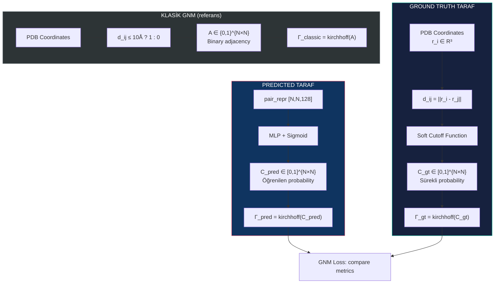
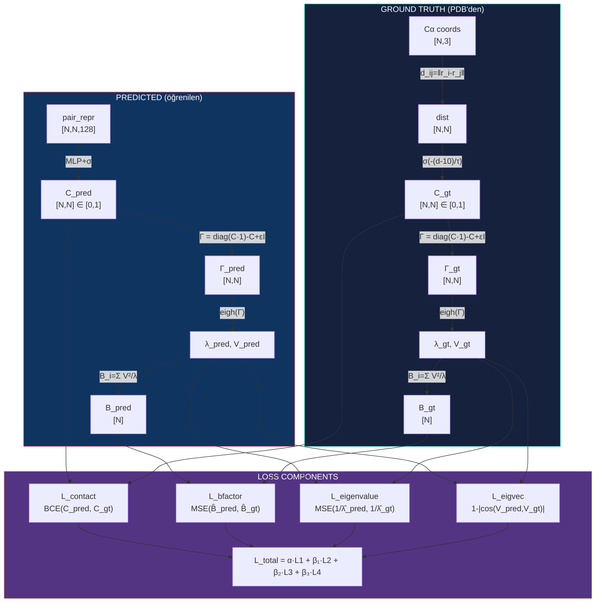

# GNM Matematiği ve Distance → Probability Dönüşümü

Bu doküman [[05-gnm-contact-learner]]'daki modelin matematiksel temelini detaylı açıklar.

---

## 1. Klasik GNM: Distance Matrix → Kirchhoff

### 1.1 Distance Matrix

Cα koordinatları `r_i ∈ R³` (i = 1..N) verildiğinde:

```
d_ij = ||r_i - r_j||₂     Euclidean distance (Ångström)
D ∈ R^{N×N}               Symmetric distance matrix
```

### 1.2 Hard Cutoff Contact Map (Klasik GNM)

Klasik GNM'de contact map **binary**:

```
         ⎧ 1   eğer d_ij ≤ r_c  ve  i ≠ j
A_ij =   ⎨
         ⎩ 0   aksi halde

r_c = 10.0 Å (standart Cα cutoff)
```

Bu adjacency matrix `A` şunu söyler: iki residue arasında mesafe 10Å'dan küçükse, aralarında bir "yay" (spring) var.

### 1.3 Kirchhoff (Gamma) Matrix

```
         ⎧ -A_ij          eğer i ≠ j    (off-diagonal)
Γ_ij =   ⎨
         ⎩  Σ_k A_ik      eğer i = j    (diagonal = coordination number)
```

Matris formunda:

```
Γ = D_coord - A

D_coord = diag(A · 1)    (her satır toplamının diagonali)
```

**Özellikler:**
- Γ simetriktir: `Γ = Γᵀ`
- Satır/sütun toplamları = 0: `Γ · 1 = 0`
- Pozitif yarı-tanımlı (PSD): tüm eigenvalue'lar ≥ 0
- Tam olarak bir eigenvalue = 0 (translasyon modu)

### 1.4 Bioinformatica'daki Mevcut Implementasyon

```python
# /Users/berat/Projects/bioinformatica/src/gnm_te.py
def _build_kirchhoff(coords, rcut):
    dist = cdist(coords, coords)           # [N, N]
    gamma = np.zeros((N, N))
    mask = (dist <= rcut) & (dist > 1e-4)  # Hard binary cutoff
    gamma[mask] = -1.0                     # Off-diag: -1 veya 0
    gamma[diag] = -gamma.sum(axis=1)       # Diag: coordination number
    return gamma
```

**Problem:** Bu binary cutoff (0 veya 1) **differentiable değil**. `d_ij = 9.99Å → contact=1`, `d_ij = 10.01Å → contact=0`. Gradient yok.

---

## 2. Bizim Yaklaşım: İki Taraflı Probability Matrix

Projemizde **iki farklı** contact/probability matrisi var ve her ikisinin de GNM'e nasıl girdiğini anlamak kritik:



---

## 3. Distance → Probability: Soft Cutoff Detayı

### 3.1 Neden Soft Cutoff?

| Yöntem | Formül | d=8Å | d=10Å | d=12Å | Differentiable? |
|--------|--------|------|-------|-------|-----------------|
| Hard (klasik) | `1 if d≤10 else 0` | 1.0 | 1.0 | 0.0 | Hayır |
| Sigmoid soft | `σ(-(d-r_c)/τ)` | 0.88 | 0.50 | 0.12 | Evet |
| Gaussian | `exp(-d²/2σ²)` | 0.73 | 0.61 | 0.49 | Evet |

**Sigmoid** tercih ediyoruz çünkü:
- `r_c = 10Å` noktasında tam 0.5 olur → klasik cutoff ile uyumlu
- `τ` parametresi ile keskinlik kontrol edilir
- GNM'in fiziksel anlamını korur

### 3.2 Sigmoid Soft Cutoff Formülü

```
                         1
C_gt(i,j) = ─────────────────────────     i ≠ j
             1 + exp((d_ij - r_c) / τ)

C_gt(i,i) = 0                              (self-contact yok)
```

**Parametreler:**
- `r_c = 10.0 Å` : Merkez noktası (klasik GNM cutoff)
- `τ` : Sıcaklık/keskinlik parametresi

### 3.3 τ Parametresinin Etkisi

```
τ = 0.1  → Neredeyse hard cutoff  (9.5Å: 0.99,  10.5Å: 0.01)
τ = 0.5  → Keskin ama smooth      (9.0Å: 0.88,  11.0Å: 0.12)
τ = 1.0  → Orta                   (8.0Å: 0.88,  12.0Å: 0.12)
τ = 1.5  → Yumuşak (önerilen)     (7.0Å: 0.88,  13.0Å: 0.12)
τ = 3.0  → Çok yumuşak            (4.0Å: 0.88,  16.0Å: 0.12)
```

```
Probability
1.0 ┤■■■■■■■■■■■■■■■■■\
    │                   \\
    │                    \\        τ=0.5 (sharp)
0.5 ┤· · · · · · · · · · ·*· · · · · · ·
    │                      \\
    │                       \\___ τ=1.5 (smooth)
0.0 ┤                         \\___________
    └──┬──┬──┬──┬──┬──┬──┬──┬──┬──┬──┬──→ d(Å)
       0  2  4  6  8  10 12 14 16 18 20

                         r_c = 10Å
```

### 3.4 Neden τ = 1.5 Öneriyoruz?

- **τ çok küçük (0.1):** Binary'ye yakın → gradient vanishing (sigmoid saturation)
- **τ çok büyük (5.0):** Her şey ~0.5 → GNM contact/non-contact ayrımı kaybolur
- **τ = 1.5:**
  - 7Å'dan yakın → probability > 0.85 (kesin contact)
  - 13Å'dan uzak → probability < 0.15 (kesin non-contact)
  - 8-12Å arası → smooth geçiş (gradient akışı iyi)

### 3.5 Pseudo-code: Ground Truth Computation

```python
def compute_gt_probability_matrix(coords_ca, r_cut=10.0, tau=1.5):
    """
    PDB Cα koordinatlarından soft probability matrix oluştur.

    Args:
        coords_ca: [N, 3] tensor, Cα positions in Ångström
        r_cut: float, center of sigmoid (klasik GNM cutoff)
        tau: float, sigmoid temperature (keskinlik)

    Returns:
        C_gt: [N, N] tensor, values in [0, 1]

    Math:
        C_gt[i,j] = sigmoid(-(d_ij - r_cut) / tau)
                   = 1 / (1 + exp((d_ij - r_cut) / tau))
        C_gt[i,i] = 0
    """
    # Step 1: Distance matrix
    # d_ij = sqrt( (x_i-x_j)² + (y_i-y_j)² + (z_i-z_j)² )
    dist = torch.cdist(coords_ca, coords_ca)  # [N, N]

    # Step 2: Sigmoid soft cutoff
    # Negatif işaret: mesafe artınca probability düşsün
    C_gt = torch.sigmoid(-(dist - r_cut) / tau)  # [N, N]

    # Step 3: Self-contact = 0
    C_gt.fill_diagonal_(0.0)

    return C_gt


# ─── ÖRNEK ────────────────────────────────────────
# 5 residue'luk toy protein:
# coords = [[0,0,0], [3.8,0,0], [7.6,0,0], [11.4,0,0], [15.2,0,0]]
#
# Distance matrix (Å):
#        r1    r2    r3    r4    r5
# r1 [  0.0,  3.8,  7.6, 11.4, 15.2]
# r2 [  3.8,  0.0,  3.8,  7.6, 11.4]
# r3 [  7.6,  3.8,  0.0,  3.8,  7.6]
# r4 [ 11.4,  7.6,  3.8,  0.0,  3.8]
# r5 [ 15.2, 11.4,  7.6,  3.8,  0.0]
#
# C_gt (r_cut=10, tau=1.5):
#        r1     r2     r3     r4     r5
# r1 [  0.00,  0.99,  0.82,  0.29,  0.03]
# r2 [  0.99,  0.00,  0.99,  0.82,  0.29]
# r3 [  0.82,  0.99,  0.00,  0.99,  0.82]
# r4 [  0.29,  0.82,  0.99,  0.00,  0.99]
# r5 [  0.03,  0.29,  0.82,  0.99,  0.00]
#
# Klasik GNM (hard cutoff d≤10):
#        r1   r2   r3   r4   r5
# r1 [  0,   1,   1,   0,   0]    ← 11.4 > 10, contact yok
# r2 [  1,   0,   1,   1,   0]
# r3 [  1,   1,   0,   1,   1]
# r4 [  0,   1,   1,   0,   1]
# r5 [  0,   0,   1,   1,   0]
#
# Soft versiyonda r1-r4 = 0.29 (belirsiz, ama bilgi var)
# Hard versiyonda r1-r4 = 0 (bilgi kaybı)
```

---

## 4. Probability Matrix → Kirchhoff Matrix

### 4.1 Klasik GNM Kirchhoff (Binary A)

```
Γ_classic = diag(A·1) - A

Örnek (5 residue, hard cutoff):
A = [[0,1,1,0,0],        Γ = [[ 2,-1,-1, 0, 0],
     [1,0,1,1,0],             [-1, 3,-1,-1, 0],
     [1,1,0,1,1],             [-1,-1, 4,-1,-1],
     [0,1,1,0,1],             [ 0,-1,-1, 3,-1],
     [0,0,1,1,0]]             [ 0, 0,-1,-1, 2]]

Satır toplamları = 0 ✓
```

### 4.2 Soft Kirchhoff (Probability C)

**Aynı formül, ama C ∈ [0,1] sürekli değerlerle:**

```
Γ_soft = diag(C·1) - C

Γ_soft[i,j] = -C[i,j]                    i ≠ j  (off-diagonal)
Γ_soft[i,i] = Σ_{k≠i} C[i,k]            i = j  (diagonal)
```

```python
def soft_kirchhoff(C, eps=1e-6):
    """
    Probability matrix → Kirchhoff matrix.

    Args:
        C: [N, N] contact probabilities in [0, 1], diagonal = 0
        eps: regularization for numerical stability

    Returns:
        Gamma: [N, N] Kirchhoff matrix (symmetric, PSD)

    Math:
        Γ = diag(C·1) - C + εI

    Properties preserved:
        - Symmetric: Γ = Γᵀ (çünkü C = Cᵀ)
        - PSD: tüm eigenvalues ≥ 0
        - Near-zero mode: en küçük eigenvalue ≈ ε (ε olmasaydı = 0)
    """
    N = C.shape[-1]

    # Off-diagonal: negatif probability
    Gamma = -C.clone()

    # Diagonal sıfırla, sonra coordination number ekle
    Gamma.fill_diagonal_(0.0)
    coord_number = C.sum(dim=-1)            # [N] her residue'nun toplam bağlantısı
    Gamma.diagonal().copy_(coord_number)

    # Regularization: eigenvalue=0 modunu ε'a kaydır
    Gamma = Gamma + eps * torch.eye(N, device=C.device)

    return Gamma
```

### 4.3 Soft vs Hard Kirchhoff Karşılaştırması

```
Örnek (5 residue), r_cut=10, tau=1.5:

Γ_hard:                              Γ_soft (approximate):
[[ 2, -1, -1,  0,  0],              [[ 2.13, -0.99, -0.82, -0.29, -0.03],
 [-1,  3, -1, -1,  0],               [-0.99,  3.09, -0.99, -0.82, -0.29],
 [-1, -1,  4, -1, -1],               [-0.82, -0.99,  3.62, -0.99, -0.82],
 [ 0, -1, -1,  3, -1],               [-0.29, -0.82, -0.99,  3.09, -0.99],
 [ 0,  0, -1, -1,  2]]               [-0.03, -0.29, -0.82, -0.99,  2.13]]

Fark: Soft versiyonda "sınırda" olan çiftler (d≈10Å) kısmi
bağlantı gösteriyor. Bu daha fiziksel ve daha differentiable.
```

---

## 5. Kirchhoff → GNM Metrikleri (Eigendecomposition)

### 5.1 Eigendecomposition

```
Γ · V_k = λ_k · V_k

λ_0 ≤ λ_1 ≤ λ_2 ≤ ... ≤ λ_{N-1}     (ascending order)

λ_0 ≈ 0   (trivial translasyon modu → SKIP)
λ_1        (en yavaş/global hareket modu)
λ_2        (ikinci en yavaş modu)
...
λ_{N-1}    (en hızlı/lokal hareket modu)
```

```python
def gnm_decompose(Gamma, n_modes=20):
    """
    Kirchhoff → GNM eigenvalues, eigenvectors, B-factors.

    Args:
        Gamma: [N, N] Kirchhoff matrix (symmetric PSD)
        n_modes: non-trivial mod sayısı

    Returns:
        eigenvalues: [n_modes] ascending, skip trivial
        eigenvectors: [N, n_modes]
        b_factors: [N] per-residue flexibility
    """
    # torch.linalg.eigh: symmetric matrix → sorted ascending eigenvalues
    # DIFFERENTIABLE! gradient Γ'ya akar
    vals, vecs = torch.linalg.eigh(Gamma)

    # ┌─────────────────────────────────────────────┐
    # │ vals[0] ≈ ε ≈ 0  (trivial mode)  → SKIP    │
    # │ vals[1] = λ_1    (slowest mode)   → USE     │
    # │ vals[2] = λ_2    (2nd slowest)    → USE     │
    # │ ...                                          │
    # │ vals[n_modes] = λ_n               → USE     │
    # └─────────────────────────────────────────────┘

    eig_vals = vals[1:n_modes+1]              # [n_modes]
    eig_vecs = vecs[:, 1:n_modes+1]           # [N, n_modes]

    # B-factors: mean-square fluctuation of each residue
    #
    #            n_modes
    # B_i = Σ    V_ik² / λ_k
    #           k=1
    #
    # Düşük λ_k (yavaş modlar) → büyük katkı
    # Yüksek V_ik² → residue i bu modda çok hareket ediyor

    inv_vals = 1.0 / (eig_vals + 1e-10)      # [n_modes]
    b_factors = (eig_vecs ** 2) @ inv_vals    # [N, n_modes] @ [n_modes] = [N]

    return eig_vals, eig_vecs, b_factors
```

### 5.2 B-factor Fiziksel Anlamı

```
B_i ∝ <Δr_i²>    mean-square fluctuation

Yüksek B_i → esnek residue (loop, terminal, disordered)
Düşük B_i  → rijit residue (core, helix interior, beta-sheet)
```

### 5.3 Örnek: 5 Residue Protein

```
Γ_soft eigendecomposition:

λ_0 ≈ 0.00  (trivial, skip)
λ_1 = 0.68  (en yavaş: tüm zincir bir bütün olarak salınır)
λ_2 = 2.15  (iki yarı karşılıklı salınır)
λ_3 = 3.94  (üçlü bölünme)
λ_4 = 5.23  (lokal hareketler)

V_1 = [-0.45, -0.23, 0.00, 0.23, 0.45]   (linear: uçtan uca)
V_2 = [ 0.38, -0.24, -0.40, -0.24, 0.38]  (quadratic: ortada node)

B-factors (normalized):
B = [1.00, 0.52, 0.38, 0.52, 1.00]

Uç residue'lar (1,5) en esnek → en yüksek B-factor
Orta residue (3) en rijit → en düşük B-factor
```

---

## 6. İki Taraflı GNM Karşılaştırma (Loss)

### 6.1 Tam Pipeline



### 6.2 Loss Bileşenleri Detay

#### L_contact: Contact Map Agreement

```python
L_contact = BCE(C_pred, C_gt)

# Ne kontrol ediyor?
# "Öğrenilen connectivity, gerçek mesafelere dayalı connectivity ile
#  piksel piksel ne kadar uyuşuyor?"
#
# d_ij = 5Å  → C_gt ≈ 0.97  → C_pred de ~1 olmalı
# d_ij = 15Å → C_gt ≈ 0.04  → C_pred de ~0 olmalı
# d_ij = 10Å → C_gt ≈ 0.50  → C_pred sınırda, öğrenilecek
```

#### L_bfactor: B-factor Profile Uyumu

```python
# Normalize (0-1 arası)
B̂_pred = B_pred / max(B_pred)
B̂_gt   = B_gt   / max(B_gt)

L_bfactor = MSE(B̂_pred, B̂_gt)

# Ne kontrol ediyor?
# "Öğrenilen connectivity'den hesaplanan GNM flexibility profili,
#  gerçek yapının flexibility profili ile aynı mı?"
#
# Eğer predicted contact map'te bir loop bölgesinin bağlantıları
# eksikse → o bölgenin B_pred'i olması gerekenden farklı olur
# → loss artar → network o bölgenin connectivity'sini düzeltir
```

#### L_eigenvalue: Spectral Uyum

```python
# Inverse eigenvalues (B-factor ağırlıkları)
inv_pred = (1/λ₁, 1/λ₂, ..., 1/λ_n)  normalized
inv_gt   = (1/λ₁, 1/λ₂, ..., 1/λ_n)  normalized

L_eigenvalue = MSE(inv_pred_norm, inv_gt_norm)

# Ne kontrol ediyor?
# "Öğrenilen ağın hareket modları frekans dağılımı, gerçek yapının
#  hareket modları frekans dağılımı ile aynı mı?"
#
# λ_1 küçük = yavaş global hareket
# Eğer predicted'da λ_1 çok büyükse → yapı olması gerekenden rijit
# → loss artar → network daha esnek bir connectivity öğrenir
```

#### L_eigvec: Mod Şekil Uyumu

```python
# Phase-invariant cosine similarity
cos_k = |V_pred[:,k] · V_gt[:,k]| / (||V_pred[:,k]|| · ||V_gt[:,k]||)

L_eigvec = mean(1 - cos_k)   for k = 1..n_modes

# Ne kontrol ediyor?
# "Hangi residue'lar birlikte hareket ediyor?
#  Predicted ve GT aynı hareket paternini mi gösteriyor?"
#
# V_1 zincirin uçtan uca salınımını gösterir
# Eğer predicted contact map'te bir taraf fazla bağlıysa
# → V_1'in şekli bozulur → cosine similarity düşer → loss artar
```

---

## 7. 10Å Cutoff: Nasıl Kullanılıyor?

### 7.1 Cutoff Kullanım Yerleri

```
┌──────────────────────────────────────────────────────────┐
│                    10Å Cutoff Kullanımı                    │
├──────────────────────────────────────────────────────────┤
│                                                            │
│  1. Ground Truth C_gt hesaplanırken:                      │
│     → sigmoid center = 10Å                                │
│     → σ(-(d - 10.0) / τ)                                 │
│     → 10Å'da probability = 0.5                            │
│                                                            │
│  2. Predicted C_pred hesaplanırken:                       │
│     → KULLANILMIYOR!                                      │
│     → Network kendi cutoff'unu öğreniyor                  │
│     → pair_repr'den direkt probability çıkıyor            │
│                                                            │
│  3. GNM Kirchhoff'a girerken:                             │
│     → Her iki C matris olduğu gibi giriyor                │
│     → Hard cutoff yok, sürekli probability                │
│     → Kirchhoff formülü aynı: Γ = diag(C·1) - C          │
│                                                            │
│  4. Klasik GNM ile validasyon:                            │
│     → Eğitim sonrası C_pred'i 0.5'te threshold'layıp     │
│       binary adjacency → klasik Kirchhoff → karşılaştır  │
│                                                            │
└──────────────────────────────────────────────────────────┘
```

### 7.2 Neden Predicted Tarafta Cutoff Yok?

```
YANLIŞ YAKLAŞIM:
pair_repr → MLP → distance_pred → hard_cutoff(10Å) → binary A
Sorun: hard cutoff'ta gradient = 0, öğrenemez!

YANLIŞ YAKLAŞIM 2:
pair_repr → MLP → distance_pred → sigmoid(-(d-10)/τ) → C_pred
Sorun: Neden önce distance sonra probability? Direkt probability öğren.

DOĞRU YAKLAŞIM (bizim):
pair_repr → MLP → logits → sigmoid → C_pred ∈ [0,1]
Her C_pred[i,j]: "residue i ile j arasında GNM spring olma olasılığı"
Network, 10Å cutoff kavramını ground truth'tan dolaylı öğrenir.
```

### 7.3 Training Sırasında Ne Oluyor?

```
Epoch 0: C_pred ≈ random [0,1]
         → Kirchhoff'u saçma → eigenvalue'lar gerçekle uyuşmaz
         → L_gnm yüksek
         → Gradient C_pred'i düzeltmeye zorlar

Epoch 50: C_pred yakın çiftler için yüksek, uzak çiftler için düşük
          → Kirchhoff gerçeğe yaklaşır
          → B-factor profili benzer
          → L_gnm düşüyor

Epoch 100: C_pred ≈ C_gt
           → GNM metrikleri neredeyse aynı
           → Network, 10Å cutoff'u dolaylı öğrenmiş

Bonus: Network 10Å'dan biraz farklı bir "öğrenilmiş cutoff"
       bulabilir → bu biyolojik olarak ilginç olabilir!
```

---

## 8. Detaylı Sayısal Örnek

### 8.1 Gerçekçi Küçük Protein: 4 Residue Helix

```
Residue positions (Cα):
r1 = [0.0,  0.0,  0.0]
r2 = [2.3,  2.0,  1.5]    (3.4Å from r1)
r3 = [1.0,  4.5,  3.0]    (5.2Å from r2, 5.4Å from r1)
r4 = [3.5,  5.0,  5.0]    (5.7Å from r3, 8.1Å from r1)
```

### 8.2 Step 1: Distance Matrix

```
D = [[ 0.0, 3.4, 5.4, 8.1],
     [ 3.4, 0.0, 5.2, 5.7],
     [ 5.4, 5.2, 0.0, 3.3],
     [ 8.1, 5.7, 3.3, 0.0]]
```

### 8.3 Step 2: Soft Contact (r_c=10, τ=1.5)

```
C_gt[i,j] = σ(-(d_ij - 10) / 1.5)

C_gt = [[ 0.00, 0.99, 0.97, 0.78],      ← tüm çiftler 10Å içinde
        [ 0.99, 0.00, 0.97, 0.95],         hepsi yüksek probability
        [ 0.97, 0.97, 0.00, 0.99],
        [ 0.78, 0.95, 0.99, 0.00]]

Eğer r4'ü uzağa taşısaydık (d=15Å):
C_gt[0,3] = σ(-(15-10)/1.5) = σ(-3.33) = 0.03  ← neredeyse 0
```

### 8.4 Step 3: Kirchhoff Matrix

```
coordination numbers:
c1 = 0.99 + 0.97 + 0.78 = 2.74
c2 = 0.99 + 0.97 + 0.95 = 2.91
c3 = 0.97 + 0.97 + 0.99 = 2.93
c4 = 0.78 + 0.95 + 0.99 = 2.72

Γ_gt = [[ 2.74, -0.99, -0.97, -0.78],
        [-0.99,  2.91, -0.97, -0.95],
        [-0.97, -0.97,  2.93, -0.99],
        [-0.78, -0.95, -0.99,  2.72]]
```

### 8.5 Step 4: Eigendecomposition

```
eigh(Γ_gt):
λ_0 = 0.00  (trivial → skip)
λ_1 = 0.92  (slowest mode)
λ_2 = 3.48  (medium mode)
λ_3 = 6.90  (fastest mode)

B-factors:
B_i = V_i1²/λ_1 + V_i2²/λ_2 + V_i3²/λ_3

B = [0.87, 0.43, 0.40, 0.79]    (normalized: [1.00, 0.49, 0.46, 0.91])

r1 ve r4 (uçlar) → yüksek B-factor (esnek)
r2 ve r3 (orta) → düşük B-factor (rijit)
```

### 8.6 Step 5: Predicted Taraf Karşılaştırma

```
Diyelim C_pred (başlangıçta kötü):
C_pred = [[0.0, 0.6, 0.3, 0.9],     ← r1-r4 çok yüksek (yanlış!)
          [0.6, 0.0, 0.5, 0.4],
          [0.3, 0.5, 0.0, 0.7],
          [0.9, 0.4, 0.7, 0.0]]

Γ_pred eigendecomposition:
B_pred_norm = [0.62, 0.55, 0.48, 1.00]

LOSSES:
L_contact = BCE(C_pred, C_gt) = 0.45    (probability uyumsuz)
L_bfactor = MSE([0.62,0.55,0.48,1.00],
                [1.00,0.49,0.46,0.91]) = 0.08  (B profili farklı)
L_eigenvalue = 0.12  (spectral uyumsuzluk)
L_eigvec = 0.23  (mod şekilleri farklı)

→ Gradient bu loss'ları azaltmak için C_pred'i düzeltir
→ r1-r4 yüksek olan değer (0.9) aşağı çekilir (gerçek: 0.78)
→ r1-r2 düşük olan değer (0.6) yukarı çekilir (gerçek: 0.99)
```

---

## 9. Gradient Akışı: Detaylı İzleme

```
L_total
  │
  ├── L_contact = BCE(C_pred, C_gt)
  │     │
  │     └── ∂L/∂C_pred = (C_pred - C_gt) / (C_pred(1-C_pred))
  │           │
  │           └── ∂C_pred/∂logits = C_pred(1 - C_pred)     [sigmoid grad]
  │                 │
  │                 └── ∂logits/∂W_mlp                       [MLP grad]
  │
  ├── L_bfactor = MSE(B̂_pred, B̂_gt)
  │     │
  │     └── ∂L/∂B_pred
  │           │
  │           └── ∂B/∂λ,∂V                    [B = Σ V²/λ]
  │                 │
  │                 └── ∂λ,∂V/∂Γ_pred         [eigh backward]
  │                       │
  │                       └── ∂Γ/∂C_pred      [Kirchhoff: Γ = D-C]
  │                             │
  │                             └── ∂C_pred/∂logits → ∂logits/∂W_mlp
  │
  └── (L_eigenvalue, L_eigvec benzer şekilde)

Sonuç: Tüm loss bileşenleri W_mlp'ye gradient verir.
OpenFold3 trunk frozen → ona gradient gitmez.
```

---

## 10. Klasik GNM ile Validasyon Protokolü

Eğitim sonrası, öğrenilen C_pred'in klasik GNM ile ne kadar uyumlu olduğunu kontrol etmek için:

```python
def validate_against_classic_gnm(C_pred, coords_ca, r_cut=10.0):
    """
    Öğrenilen probability matrix'i klasik binary GNM ile karşılaştır.
    """
    # 1. C_pred'i 0.5'te threshold'la → binary
    A_pred = (C_pred > 0.5).float()

    # 2. Klasik GNM (hard cutoff)
    dist = torch.cdist(coords_ca, coords_ca)
    A_classic = ((dist <= r_cut) & (dist > 0.01)).float()

    # 3. Adjacency agreement
    accuracy = (A_pred == A_classic).float().mean()

    # 4. Kirchhoff ve B-factor karşılaştırma
    Gamma_pred = hard_kirchhoff(A_pred)
    Gamma_classic = hard_kirchhoff(A_classic)

    _, _, bf_pred = gnm_decompose(Gamma_pred)
    _, _, bf_classic = gnm_decompose(Gamma_classic)

    pearson_r = correlation(bf_pred, bf_classic)

    return {
        'adjacency_accuracy': accuracy,
        'bfactor_correlation': pearson_r,
    }
```

---

## Related
- [[05-gnm-contact-learner]] - Ana implementasyon planı
- [[02-model-architecture]] - OpenFold3 pair_repr detayı
- [[../modules/pairformer]] - PairFormer output shape

#gnm #mathematics #kirchhoff #contact-map #eigendecomposition #differentiable
