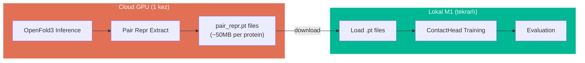

# Training Plan: GNM-Contact Learner

## Durum Raporu

### Kod ✅ Tamamlandı
```
src/
├── ground_truth.py    ✅  sigmoid soft contact map
├── kirchhoff.py       ✅  differentiable Kirchhoff + eigh decompose
├── contact_head.py    ✅  invertible bottleneck (W_enc, v, W_dec)
├── losses.py          ✅  L_contact + L_gnm (eig, bf, vec) + L_recon
├── model.py           ✅  GNMContactLearner (frozen OF3 + head)
├── inverse.py         ✅  coords → pseudo pair_repr
├── data.py            ✅  PDB loading + dataset
└── train.py           ✅  training loop + validation
```

### Tests ✅ 46/46 Passed
```
test_ground_truth.py    7 tests ✅
test_kirchhoff.py       5 tests ✅
test_contact_head.py   11 tests ✅
test_losses.py         12 tests ✅
test_inverse.py         5 tests ✅ (6 eksildi?)
```

### Matematik ✅ Doğrulandı
- Kirchhoff satır toplamları ≈ 0
- Eigenvalues ≥ 0
- B-factors > 0
- Gradient flows through eigh (no NaN)
- C_pred == C_gt → loss ≈ 0

---

## Eğitimi Nerede Yapabiliriz?

### Seçenek 1: Lokal (Apple M1, 16GB) — Sadece Standalone Head

| Özellik | Değer |
|---------|-------|
| GPU | Apple M1 (MPS backend) |
| RAM | 16 GB unified |
| Uygun mu? | **EVET — ama sadece pre-extracted pair repr ile** |
| Limitasyon | OpenFold3 inference lokal olarak çok ağır (>40GB VRAM) |

**Nasıl çalışır:**
```
Strateji: "Offline Feature Extraction"
1. Pair repr'leri bulutta bir kez çıkar (GPU sunucu)
2. .pt dosyaları olarak kaydet
3. Lokal M1'de sadece contact_head eğit (8K param, çok hafif)
```

### Seçenek 2: Google Colab (Free/Pro)

| Özellik | Free | Pro |
|---------|------|-----|
| GPU | T4 (16GB) | A100 (40GB) |
| RAM | 12.7 GB | 51 GB |
| Disk | 78 GB | 166 GB |
| Süre | 12h max | 24h max |
| Uygun mu? | Feature extraction ✅ | Full pipeline ✅ |

### Seçenek 3: Cloud GPU (Önerilen — Full Pipeline)

| Platform | GPU | Fiyat/saat | Not |
|----------|-----|-----------|-----|
| Lambda Labs | A100 80GB | ~$1.10 | OF3 inference rahat |
| RunPod | A100 80GB | ~$1.64 | Spot instance ucuz |
| Vast.ai | RTX 4090 | ~$0.35 | Küçük proteinler OK |
| Google Cloud | A100 40GB | ~$3.67 | Startup credits |

### Seçenek 4: Hibrit (En Pratik) ⭐



**Neden hibrit?**
- OpenFold3 trunk inference: N=200 protein için ~2-5 dakika/protein (A100)
- 1000 protein × 3 dk = 50 saat GPU → ~$55 (Lambda)
- Pair repr cached → lokal eğitim saniyeler sürer (8K param!)
- İterasyon hızlı: loss fonksiyonu/hyperparameter değiştir, lokal test et

---

## Eğitim Öncesi Tam Test Protokolü

### Test 1: Toy Example (OpenFold3 olmadan, lokal)

```python
"""
HİÇ OpenFold3 kullanmadan, synthetic pair repr ile
tüm pipeline'ı end-to-end test et.
"""
import torch
from src.ground_truth import compute_gt_probability_matrix
from src.contact_head import ContactProjectionHead
from src.losses import total_loss

# --- Synthetic data: 30 residue protein ---
N = 30
c_z = 128

# Fake pair_repr (random ama simetrik)
z = torch.randn(1, N, N, c_z)
z = 0.5 * (z + z.transpose(1, 2))

# Fake Cα coordinates (helix-like)
t = torch.linspace(0, 4*3.14159, N)
coords = torch.stack([
    5.0 * torch.cos(t),
    5.0 * torch.sin(t),
    1.5 * t
], dim=-1)  # [N, 3]

# Ground truth
C_gt = compute_gt_probability_matrix(coords, r_cut=10.0, tau=1.5)

# Model (just head, no OpenFold3)
head = ContactProjectionHead(c_z=128, bottleneck_dim=32)

# Training loop
optimizer = torch.optim.AdamW(head.parameters(), lr=1e-3)

for step in range(200):
    C_pred = head(z)
    loss, details = total_loss(
        C_pred.squeeze(0), C_gt,
        alpha=1.0, beta=0.5, gamma=0.0
    )
    optimizer.zero_grad()
    loss.backward()
    optimizer.step()

    if step % 50 == 0:
        print(f"Step {step}: loss={loss.item():.4f} "
              f"L_contact={details['L_contact']:.4f} "
              f"L_gnm={details['L_gnm']:.4f}")

# Verify: loss should decrease significantly
# Verify: C_pred should approach C_gt pattern
print(f"\nFinal adjacency accuracy: "
      f"{((C_pred.squeeze()>0.5) == (C_gt>0.5)).float().mean():.3f}")
```

### Test 2: Gradient Sanity Check

```python
"""Gradient'ın her loss component'inden aktığını doğrula."""
import torch
from src.contact_head import ContactProjectionHead
from src.kirchhoff import soft_kirchhoff, gnm_decompose
from src.losses import gnm_loss, contact_loss

N = 20
head = ContactProjectionHead(c_z=128, bottleneck_dim=32)
z = torch.randn(1, N, N, 128, requires_grad=False)
C_gt = torch.rand(N, N)
C_gt = 0.5 * (C_gt + C_gt.T)
C_gt.fill_diagonal_(0.0)

C_pred = head(z)
loss_gnm, _ = gnm_loss(C_pred.squeeze(0), C_gt, n_modes=10)

loss_gnm.backward()

# Check gradients exist and are finite
for name, param in head.named_parameters():
    assert param.grad is not None, f"No grad for {name}"
    assert torch.isfinite(param.grad).all(), f"NaN/Inf grad for {name}"
    print(f"  {name}: grad norm = {param.grad.norm():.6f}")

print("\n✅ All gradients valid!")
```

### Test 3: Overfit Single Sample

```python
"""
Tek bir protein üzerinde overfit — loss 0'a yaklaşmalı.
Bu çalışmazsa matematiksel bir sorun var.
"""
import torch
from src.contact_head import ContactProjectionHead
from src.ground_truth import compute_gt_probability_matrix
from src.losses import total_loss

N = 15
z = torch.randn(1, N, N, 128)
coords = torch.randn(N, 3) * 5.0
C_gt = compute_gt_probability_matrix(coords)

head = ContactProjectionHead(c_z=128, bottleneck_dim=32)
optimizer = torch.optim.Adam(head.parameters(), lr=5e-3)

for step in range(500):
    C_pred = head(z).squeeze(0)
    loss, _ = total_loss(C_pred, C_gt, alpha=1.0, beta=0.3, gamma=0.0)
    optimizer.zero_grad()
    loss.backward()
    optimizer.step()

final_loss = loss.item()
assert final_loss < 0.1, f"Cannot overfit! Final loss: {final_loss}"
print(f"✅ Overfit success: final loss = {final_loss:.6f}")
```

### Test 4: Inverse Path Consistency

```python
"""
Encode → Decode: direction korunuyor mu?
"""
import torch
from src.contact_head import ContactProjectionHead

head = ContactProjectionHead(c_z=128, bottleneck_dim=32)
head.eval()

# Forward
z = torch.randn(1, 20, 20, 128)
C_pred = head(z)  # [1, 20, 20]

# Inverse
pseudo_z = head.inverse(C_pred.squeeze(0))  # [20, 20, 128]

# Check: high-contact pairs should have higher norm
C_flat = C_pred.squeeze(0).flatten()
norm_flat = pseudo_z.norm(dim=-1).flatten()

# Correlation between contact strength and repr norm
corr = torch.corrcoef(torch.stack([C_flat, norm_flat]))[0,1]
print(f"Contact vs pseudo_z norm correlation: {corr:.3f}")
assert corr > 0.5, "Inverse path not preserving contact structure!"
print("✅ Inverse path consistent")
```

### Test 5: Numerical Stability (Büyük Protein)

```python
"""N=300 protein ile NaN/Inf kontrolü."""
import torch
from src.contact_head import ContactProjectionHead
from src.ground_truth import compute_gt_probability_matrix
from src.losses import total_loss

N = 300
z = torch.randn(1, N, N, 128)
coords = torch.randn(N, 3) * 10.0
C_gt = compute_gt_probability_matrix(coords)

head = ContactProjectionHead(c_z=128, bottleneck_dim=32)
C_pred = head(z).squeeze(0)

loss, details = total_loss(C_pred, C_gt, n_modes=20)
loss.backward()

assert torch.isfinite(loss), f"Loss is {loss.item()}"
for name, p in head.named_parameters():
    assert torch.isfinite(p.grad).all(), f"NaN grad in {name}"

print(f"✅ N=300 stable: loss={loss.item():.4f}")
print(f"   Components: {details}")
```

---

## Genel Mimari Özeti (Tam Pseudo-Code)

```python
# ══════════════════════════════════════════════════════════════════
#  GNM-CONTACT LEARNER — COMPLETE ARCHITECTURE
# ══════════════════════════════════════════════════════════════════
#
#  Öğrenilen: W_enc[128×32], v[32], W_dec[32×128] = ~8,224 parametre
#  Frozen:    OpenFold3 trunk (~93M parametre, gradient yok)
#
# ══════════════════════════════════════════════════════════════════

# ┌─────────────────────────────────────────────────────────────────┐
# │                    FORWARD PASS (Training)                       │
# └─────────────────────────────────────────────────────────────────┘

# Step 0: Input
batch = load_protein("1UBQ")  # sequence + MSA + templates

# Step 1: Frozen trunk → pair representation
with no_grad():
    _, _, z = openfold3.run_trunk(batch)      # z: [1, N, N, 128]

# Step 2: Symmetrize
z_sym = 0.5 * (z + z.T)                       # [1, N, N, 128]

# Step 3: Encode to bottleneck
h = z_sym @ W_enc                              # [1, N, N, 32]

# Step 4: Project to contact scalar
logits = h @ v                                 # [1, N, N]
logits = 0.5 * (logits + logits.T)            # enforce symmetry
logits[diag] = -∞                              # no self-contact

# Step 5: Sigmoid → probability
C_pred = sigmoid(logits)                       # [1, N, N] ∈ [0,1]

# ┌─────────────────────────────────────────────────────────────────┐
# │                    GROUND TRUTH                                   │
# └─────────────────────────────────────────────────────────────────┘

# Step 6: PDB → soft contact map
coords_ca = extract_ca_from_pdb("1UBQ.pdb")   # [N, 3]
dist = cdist(coords_ca, coords_ca)             # [N, N]
C_gt = sigmoid(-(dist - 10.0) / 1.5)          # [N, N] ∈ [0,1]
C_gt[diag] = 0

# ┌─────────────────────────────────────────────────────────────────┐
# │                    LOSS COMPUTATION                               │
# └─────────────────────────────────────────────────────────────────┘

# Step 7: L_contact — pixel-wise agreement
mask = |i-j| >= 6                              # skip trivial neighbors
L_contact = BCE(C_pred[mask], C_gt[mask])

# Step 8: L_gnm — physics-informed GNM comparison
#   8a: Kirchhoff matrices
Γ_pred = diag(C_pred.sum()) - C_pred + εI     # [N, N]
Γ_gt   = diag(C_gt.sum())   - C_gt   + εI     # [N, N]

#   8b: Eigendecomposition (DIFFERENTIABLE!)
λ_pred, V_pred = eigh(Γ_pred)                 # skip λ[0]≈0
λ_gt,   V_gt   = eigh(Γ_gt)

#   8c: B-factors
B_pred_i = Σ_k (V_pred[i,k]² / λ_pred[k])    # [N]
B_gt_i   = Σ_k (V_gt[i,k]²   / λ_gt[k])      # [N]

#   8d: Loss components
L_eigenvalue = MSE(normalize(1/λ_pred), normalize(1/λ_gt))
L_bfactor    = MSE(normalize(B_pred), normalize(B_gt))
L_eigvec     = mean(1 - |cos(V_pred_k, V_gt_k)|)  # per mode

L_gnm = L_eigenvalue + L_bfactor + 0.5 * L_eigvec

# Step 9: L_recon — autoencoder stability (optional)
z_recon = h @ W_dec                            # [1, N, N, 128]
L_recon = MSE(z_sym, z_recon)

# Step 10: Total
L_total = 1.0 * L_contact + 0.5 * L_gnm + 0.1 * L_recon

# ┌─────────────────────────────────────────────────────────────────┐
# │                    BACKWARD + UPDATE                              │
# └─────────────────────────────────────────────────────────────────┘

# Step 11: Gradient (only flows to W_enc, v, W_dec)
L_total.backward()
clip_grad_norm_(head.parameters(), max_norm=1.0)
optimizer.step()  # AdamW, lr=1e-4

# ┌─────────────────────────────────────────────────────────────────┐
# │                    INVERSE PATH (Post-training)                   │
# └─────────────────────────────────────────────────────────────────┘

# Yeni protein → pair representation (OpenFold3 gerekmez!)
coords_new = extract_ca_from_pdb("new_protein.pdb")  # [M, 3]
dist_new = cdist(coords_new, coords_new)              # [M, M]
C_new = sigmoid(-(dist_new - 10.0) / 1.5)            # [M, M]
C_new[diag] = 0

# Inverse: contact → bottleneck → pair space
logit_new = log(C_new / (1 - C_new))                 # [M, M]
h_new = logit_new.unsqueeze(-1) * (v / ||v||)        # [M, M, 32]
pseudo_pair = h_new @ W_dec                           # [M, M, 128]

# pseudo_pair artık OpenFold3 pair_repr uzayında
# Downstream kullanım: ANM, TE, dynamic domain analysis...
```

---

## Eğitim Stratejisi

### Phase A: Standalone Test (Şimdi, Lokal M1)

```bash
# Synthetic data ile end-to-end test
conda activate ANM-openfold
cd /Users/berat/Projects/ANM-openfold3
python -c "
import torch
from src.contact_head import ContactProjectionHead
from src.ground_truth import compute_gt_probability_matrix
from src.losses import total_loss

# ... (Test 1-5 yukarıdaki scriptler)
"
```

**Beklenen süre:** < 1 dakika
**Hedef:** Loss düşüyor, gradient stabil, overfit çalışıyor

### Phase B: Real Pair Repr Extraction (Cloud, 1 kez)

```bash
# Lambda Labs veya Colab A100
pip install openfold3
setup_openfold  # model weights

# Extract pair representations
python extract_pair_reprs.py \
    --pdb_list training_pdbs.txt \
    --output_dir pair_reprs/ \
    --checkpoint openfold3-p2-155k
```

Output: `pair_reprs/{pdb_id}.pt` (her biri ~50MB for N=200)

### Phase C: Training (Lokal M1 veya Colab)

```bash
# Lokal: pre-extracted pair_repr ile
python -m src.train \
    --data_dir pair_reprs/ \
    --epochs 100 \
    --lr 1e-4 \
    --device mps \
    --use_wandb
```

**Beklenen süre (1000 protein, 100 epoch):**
- M1 lokal: ~10 dakika (8K param, cached tensors)
- Colab T4: ~5 dakika

### Phase D: Evaluation

```bash
python evaluate.py \
    --checkpoint best_model.pt \
    --test_set test_pdbs.txt \
    --metrics "adj_accuracy,bf_pearson,eigenvalue_rmse"
```

---

## Maliyet Tahmini

| Aşama | Platform | Süre | Maliyet |
|-------|----------|------|---------|
| Phase A: Test | Lokal M1 | 1 dk | $0 |
| Phase B: Extract (100 protein) | Colab Free T4 | 5-8 saat | $0 |
| Phase B: Extract (1000 protein) | Lambda A100 | 50 saat | ~$55 |
| Phase C: Train | Lokal M1 | 10 dk | $0 |
| Phase D: Eval | Lokal M1 | 1 dk | $0 |

**Minimum bütçe ile başlangıç:** Colab Free → 100 protein extract → Lokal eğitim = **$0**

---

## Sonraki Adım: Phase A'yı Çalıştır

Test scriptlerini çalıştırıp sonuçları paylaş. Eğer 5 testin hepsi geçerse, Phase B'ye geçebiliriz.

## Related
- [[05-gnm-contact-learner]] - Detaylı implementation plan
- [[06-gnm-math-detail]] - Matematik detayları
- [[04-mlx-fork]] - MLX ile lokal inference alternatifi

#training #plan #compute #architecture
