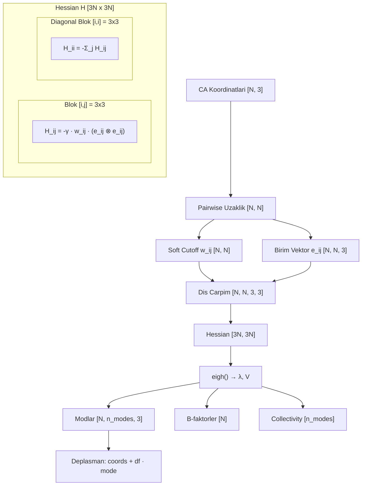

# 08 - ANM (Anisotropic Network Model) Teorisi

> GNM skaler (izotropik) iken, ANM **yonlu** (anizotropik) bilgi verir: her residue'nun 3D deplasman yonunu bildirir. Bu, yapilari fiziksel modlar boyunca hareket ettirmemizi saglar.

## 1. GNM'den ANM'e: Neden Yonlu Bilgi Lazim?

[[06-gnm-math-detail]] belgesinde tanimlanan GNM, **N x N Kirchhoff matrisi** ile calisir:
- Cikti: skaler B-faktorler (residue basi esneklik buyuklugu)
- Eksik: hareket **yonu** yok — sadece "ne kadar" var, "nereye" yok

ANM bunu cozer:
- **3N x 3N Hessian matrisi** ile calisir (her residue icin x, y, z)
- Cikti: her residue icin **3D deplasman vektoru** (buyukluk + yon)
- Dusuk frekansli modlar = hinge, shear, twist gibi buyuk olcekli hareketler

| Ozellik | GNM | ANM |
|---------|-----|-----|
| Matris boyutu | N x N | 3N x 3N |
| Matris tipi | Kirchhoff (Laplacian) | Hessian (kuvvet sabiti) |
| Trivial mod sayisi | 1 (uniform) | 6 (3 translation + 3 rotation) |
| Cikti bilgisi | Skaler (buyukluk) | Vektorel (3D yon + buyukluk) |
| B-factor | B_i = sum_k(1/lambda_k * u_ik^2) | B_i = sum_k(\\|v_k_i\\|^2 / lambda_k) |
| Deplasman | Yok | var: coords + df * mode |
| Hesaplama maliyeti | O(N^3) | O((3N)^3) = O(27N^3) |
| Tipik cutoff | 7-10 A | 13-15 A |

## 2. ANM Hessian Yapisi

### 2.1 Super-Element Bloklar

Hessian, **N x N tane 3x3 bloktan** olusur:

```
H = [ H_11  H_12  ...  H_1N ]
    [ H_21  H_22  ...  H_2N ]
    [ ...   ...   ...  ...  ]
    [ H_N1  H_N2  ...  H_NN ]

Her H_ij bir 3x3 matristir.
Toplam boyut: 3N x 3N
```

### 2.2 Off-Diagonal Bloklar (i != j)

```
r_ij = r_j - r_i                    # [3] fark vektoru
d_ij = ||r_ij||                      # skaler uzaklik
w_ij = sigmoid(-(d_ij - r_cut) / tau)  # yumusak temas
e_ij = r_ij / d_ij                   # birim vektor

H_ij = -gamma * w_ij * (e_ij ⊗ e_ij)    # 3x3 dis carpim
```

Dis carpim acik hali:
```
e_ij ⊗ e_ij = | ex*ex  ex*ey  ex*ez |
              | ey*ex  ey*ey  ey*ez |
              | ez*ex  ez*ey  ez*ez |
```

### 2.3 Diagonal Bloklar

```
H_ii = -sum_{j != i} H_ij
```

Satir toplami = 0 kosulunu saglar (translasyonel degismezlik).

### 2.4 Vektorize Hesaplama

```python
diff = coords[None,:,:] - coords[:,None,:]     # [N, N, 3]
dist = diff.norm(dim=-1)                       # [N, N]
w = sigmoid(-(dist - cutoff) / tau)            # [N, N]
w = w * (1 - eye(N))                           # diagonal'i sifirla

e = diff / (dist.unsqueeze(-1) + eps)          # [N, N, 3]
outer = e.unsqueeze(-1) * e.unsqueeze(-2)      # [N, N, 3, 3]
H_blocks = -gamma * w[..., None, None] * outer # [N, N, 3, 3]

H_blocks[i, i] = -sum_j(H_blocks[i, j])       # diagonal
H = H_blocks.permute(0, 2, 1, 3).reshape(3*N, 3*N)
```

## 3. Eigendecomposition

### 3.1 Normal Modlar

```
H v_k = lambda_k v_k
```

- `lambda_k`: eigenvalue (frekans^2 ile orantili)
- `v_k in R^{3N}`: eigenvector (normal mod)

### 3.2 Trivial Modlar (Ilk 6)

ANM Hessian'i rank 3N - 6'dir:
- 3 translasyon modu (x, y, z boyunca uniform kayma)
- 3 rotasyon modu (x, y, z ekseni etrafinda donme)
- Bu modlarin eigenvalue'lari ~ 0

**GNM farki:** GNM'de sadece 1 trivial mod.

### 3.3 Non-Trivial Modlar (7 ve sonrasi)

```
Mod  7: En dusuk frekans → en buyuk olcekli hareket (hinge bending)
Mod  8: Ikinci dusuk → shear, twist
...
Mod 3N: En yuksek frekans → en lokal hareket
```

Eigenvector reshape:
```
v_k in R^{3N} → reshape → [N, 3]  (per-residue 3D deplasman yonu)
```

## 4. Collectivity Metrigi

### 4.1 Tanim

Bir modun ne kadar **kollektif** oldugunu olcer — kac residue katiliyor?

```
κ_k = (1/N) · exp(-Σ_i u²_ki · ln(u²_ki))
```

- `u²_ki = ||v_k_i||² / Σ_j ||v_k_j||²` — normalize kare deplasman
- Shannon entropi tabanli
- Aralik: 1/N (tek residue hareket ediyor) ... 1.0 (tum residue'ler esit)

**Referans:** Bruschweiler (1995) J Chem Phys 102:3396-3403

### 4.2 Fiziksel Anlam

| κ Araligi | Mod Tipi | Ornek |
|-----------|----------|-------|
| 0.7 - 1.0 | Cok kollektif | Hinge bending, domain motion |
| 0.4 - 0.7 | Orta kollektif | Domain shear, twist |
| 0.1 - 0.4 | Az kollektif | Loop motion |
| < 0.1 | Lokalize | Side-chain vibration |

### 4.3 Coklu Mod Combinasyonu icin Collectivity

Tek mod degil, mod alt kumeleri icin de collectivity hesaplanir:

```python
# Modlarin deplasman vektorlerini topla
combined_i = Σ_k v_k_i    # [N, 3]

# Toplam vektorun collectivity'sini hesapla
κ_combo = collectivity(combined)
```

Pipeline bu degere gore kombinasyonlari siralar: en kollektif combo once denenir.

## 5. Mod-Suruklenmeli Deplasman

### 5.1 Tek Mod

```
new_coords = coords + df * v_k.reshape(N, 3)
```

`df` (displacement factor): deplasman buyuklugu (Angstrom cinsinden).

### 5.2 Coklu Mod (Global df ile)

```
new_coords = coords + Σ_k (df/√k * v_k_i)
```

- Her mod esit agirlik alir
- `df/√k` normalizasyonu: k mod birlestirince buyukluk korunur
- `df` dogrudan Angstrom-olcekli kontrol saglar

### 5.3 df Eskalasyonu

Eger kucuk df yeterli deplasman saglamiyorsa, pipeline otomatik olarak df'yi arttirir:

```
df_min=0.3 → 0.45 → 0.675 → 1.01 → ... → df_max=3.0
         ×1.5   ×1.5    ×1.5
```

## 6. ANM B-Faktorler

```
B_i = sum_k (||v_k_i||^2 / lambda_k)
```

GNM ile karsilastirma:
```
B_i^GNM = sum_k (u_ik^2 / lambda_k)      # skaler
B_i^ANM = sum_k (||v_k_i||^2 / lambda_k)  # vektorel
```

Ikisi arasinda Pearson r > 0.8 beklenir.

## 7. Hessian Blok Yapisi Diyagrami



## 8. Parametreler

| Parametre | Tipik Deger | Aciklama |
|-----------|-------------|----------|
| `cutoff` | 15.0 Å | ANM icin GNM'den daha genis |
| `gamma` | 1.0 | Uniform yay sabiti |
| `tau` | 1.0 | Sigmoid sicakligi |
| `n_modes` | 20 | Ilk 20 non-trivial mod |
| `df` | 0.6 Å | Global deplasman faktoru |
| `df_min` | 0.3 Å | Eskalasyon baslangic |
| `df_max` | 3.0 Å | Eskalasyon maksimum |
| `max_combo_size` | 3 | Maks mod/kombinasyon |

## Iliskili Dokumanlar

- [[06-gnm-math-detail]] — GNM matematigi (Kirchhoff, skaler eigendecomposition)
- [[09-anm-mode-drive]] — ANM modlarini OF3 diffusion ile birlestiren pipeline
- [[05-gnm-contact-learner]] — Contact head: z_ij ↔ C donusumu
