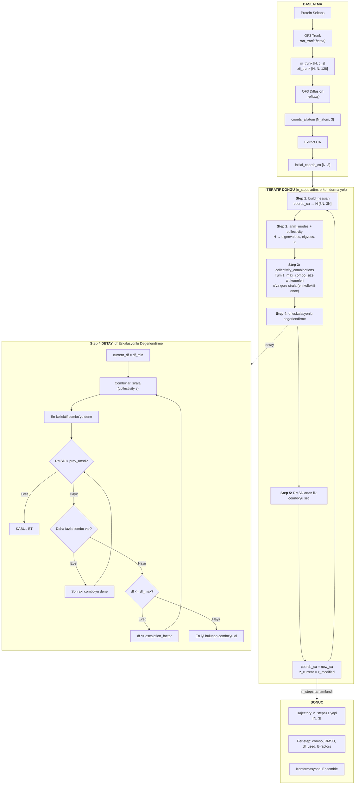
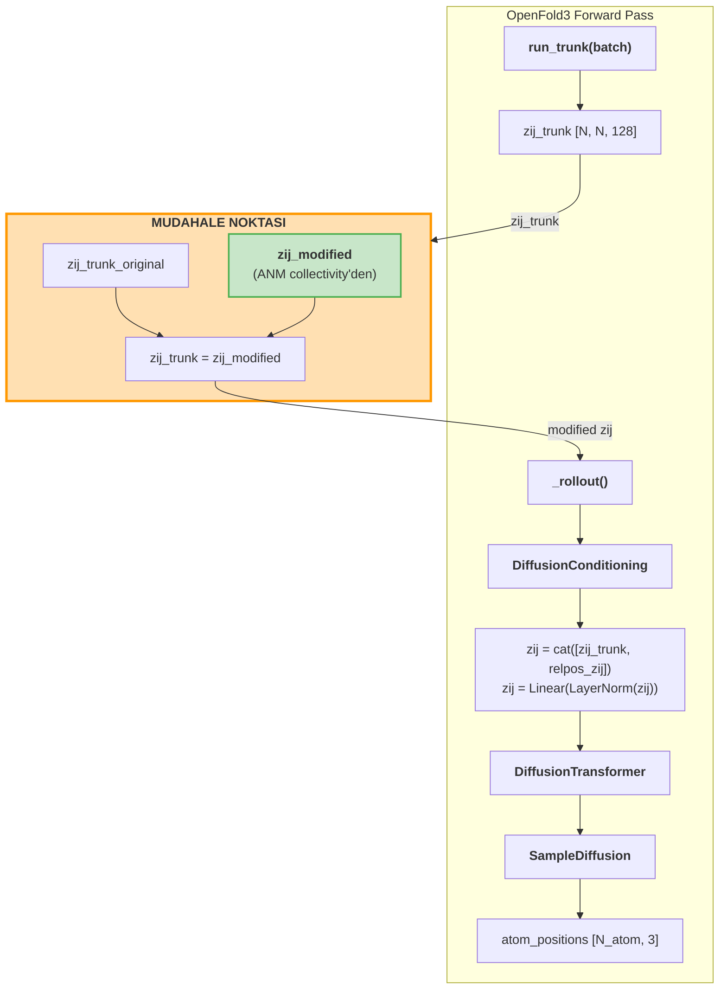
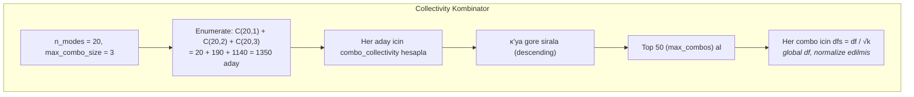

# 09 - ANM Mode-Drive Pipeline

> OF3 diffusion'dan cikan yapiyi ANM modlari boyunca hareket ettirip, yeni koordinatlardan z_ij uretip diffusion'a geri besleyerek **iteratif konformasyonel kesif** yapan pipeline.

## 1. Genel Bakis

**Problem:** OF3 tek bir statik yapi uretir. Protein dinamigi icin birden fazla konformasyon gerekir.

**Cozum:** ANM'in dusuk frekansli modlari (hinge, shear) fiziksel olarak anlamli buyuk olcekli hareketleri temsil eder. Bu modlar boyunca yapiyi hareket ettirip, yeni koordinatlardan contact map → pseudo z_ij → diffusion zinciri ile yeni yapilar uretebiliriz.

**Temel fikir:** `z_ij` (pair representation) OF3'un diffusion modulu icin **kontrol sinyali** gorevi gorur. ANM deplasmanlarindan turetilen z_ij, diffusion'i fiziksel olarak anlamli yonlere yonlendirir.

**Hedef:** Initial structure'dan baslayip, final yapiyi **bilmeden** konformasyonel uzayi kesfetmek. RMSD initial'den olculur — yuksek RMSD = daha fazla kesif = iyi.

---

## 2. Collectivity-Tabanli Strateji

Onceki versiyon random mod secimi kullaniyordu. Yeni versiyon **collectivity** metrigi ile modlari siraliyor:

### 2.1 Collectivity Metrigi

```
κ_k = (1/N) · exp(-Σ_i u²_ki · ln(u²_ki))
```

- `u²_ki = ||v_k_i||² / Σ_j ||v_k_j||²` — normalize edilmis kare deplasman
- Shannon entropisi tabanli: ne kadar cok residue katilirsa o kadar kollektif
- Aralik: 1/N (lokalize) ile 1.0 (maksimum kollektif)

**Referans:** Bruschweiler (1995) J Chem Phys 102:3396-3403

### 2.2 Coklu Mod Collectivity

Tek mod icin degil, mod **kombinasyonlari** icin collectivity hesaplanir:

```python
# Secilen modlarin deplasman vektorlerini topla
combined = Σ_k v_k_i    # [N, 3]

# Toplam vektorun collectivity'sini hesapla
sq_norms = ||combined_i||²                    # [N]
u² = sq_norms / Σ_j sq_norms_j               # [N] normalize
κ = (1/N) · exp(-Σ_i u²_i · ln(u²_i))       # skaler
```

### 2.3 Global df Parametresi

Eski yaklasim: her mod icin ayri random df sampling.
Yeni yaklasim: **tek bir global df** (ornek: 0.6 Å).

```
1. Kombine deplasman vektoru hesapla: Σ_k v_k
2. Her mod esit agirlik alir, normalize edilir: df / sqrt(k)
3. Sonuc: tutarli Angstrom-olcekli deplasman buyuklugu
```

### 2.4 df Eskalasyonu

Eger en kollektif kombinasyon RMSD artisi saglamiyorsa:

```
df_min=0.3 → dene → RMSD artmadi
df *= 1.5 → 0.45 → dene → RMSD artmadi
df *= 1.5 → 0.675 → dene → RMSD artti! → kabul et
...
df_max=3.0'a kadar devam
```

---

## 3. Pipeline Genel Goruntu



---

## 4. Veri Donusum Zinciri (Shape Tracking)

```mermaid
flowchart LR
    subgraph INPUT["Giris"]
        I1["coords_ca<br/><b>[N, 3]</b><br/><i>float32, Angstrom</i>"]
    end

    subgraph HESSIAN["ANM Hessian"]
        H1["diff = coords[j] - coords[i]<br/><b>[N, N, 3]</b>"]
        H2["dist = ||diff||<br/><b>[N, N]</b>"]
        H3["w = sigmoid(-(dist-15)/tau)<br/><b>[N, N]</b>"]
        H4["e = diff / dist<br/><b>[N, N, 3]</b>"]
        H5["outer = e ⊗ e<br/><b>[N, N, 3, 3]</b>"]
        H6["H_blocks = -γ·w·outer<br/><b>[N, N, 3, 3]</b>"]
        H7["H_blocks[i,i] = -Σ_j H_blocks[i,j]"]
        H8["reshape<br/><b>[3N, 3N]</b>"]
    end

    subgraph EIGEN["Eigendecomposition + Collectivity"]
        E1["eigh(H) on CPU float64"]
        E2["Skip first 6 trivial"]
        E3["eigenvalues<br/><b>[n_modes]</b>"]
        E4["eigenvectors<br/><b>[N, n_modes, 3]</b>"]
        E5["collectivity(eigvecs)<br/><b>[n_modes]</b><br/><i>per-mode κ</i>"]
    end

    I1 --> H1 --> H2 --> H3
    H2 --> H4 --> H5
    H3 --> H6
    H5 --> H6 --> H7 --> H8
    H8 --> E1 --> E2 --> E3
    E2 --> E4 --> E5
```



---

## 5. Deplasman ve z_ij Donusum Zinciri

```mermaid
flowchart TB
    subgraph SELECT["Collectivity-Ranked Mod Secimi"]
        S1["Tum C(n_modes, 1..max_combo_size)<br/>alt kumelerini enumerate et"]
        S2["Her kume icin combo_collectivity hesapla"]
        S3["κ'ya gore sirala (en kollektif once)"]
        S4["ModeCombo:<br/>mode_indices = (0, 2)<br/>dfs = (0.42, 0.42)<br/><i>df/√k normalize</i>"]
    end

    subgraph DISPLACE["Deplasman"]
        D1["weighted = modes_sel * dfs[None,:,None]<br/><b>[N, k, 3]</b>"]
        D2["displacement = weighted.sum(dim=1)<br/><b>[N, 3]</b>"]
        D3["new_coords = coords + displacement<br/><b>[N, 3]</b>"]
    end

    subgraph CONTACT["Contact Map"]
        CT1["dist = cdist(new_coords)<br/><b>[N, N]</b>"]
        CT2["C = sigmoid(-(dist - 10.0) / 1.5)<br/><b>[N, N]</b>"]
    end

    subgraph INVERSE["Inverse Path (Trained Head)"]
        IV1["logit = log(C / (1-C))<br/><b>[N, N]</b>"]
        IV3["h_approx = logit · v_norm<br/><b>[N, N, 64]</b>"]
        IV4["z_pseudo = W_dec(h_approx)<br/><b>[N, N, 128]</b>"]
    end

    subgraph BLEND["z_ij Blending"]
        BL1["Normalize: z_n = (z_pseudo - μ) / σ · σ_trunk + μ_trunk"]
        BL2["z_modified = α·z_n + (1-α)·z_trunk<br/><b>[N, N, 128]</b>"]
    end

    subgraph SCORE["Skorlama"]
        SC1["RMSD = ||<b>initial</b>_ca - new_ca||<br/><b>Yuksek = Iyi (daha fazla kesif)</b>"]
    end

    S1 --> S2 --> S3 --> S4
    S4 --> D1 --> D2 --> D3
    D3 --> CT1 --> CT2
    CT2 --> IV1 --> IV3 --> IV4
    IV4 --> BL1 --> BL2
    BL2 --> SC1
```



---

## 6. OF3 Entegrasyon Noktasi



**Kritik:** `_rollout()` fonksiyonuna girmeden once `zij_trunk`'i degistiriyoruz. Hicbir OF3 kodu modifiye edilmiyor.

---

## 7. Mod Kombinasyon Stratejileri

### 7a. Collectivity (Varsayilan)



**Avantaj:** Fiziksel olarak en anlamli (en cok residue'yu hareket ettiren) kombinasyon once denenir.

### 7b. Random Ornekleme

Eigenvalue-weighted random sampling: `p(k) ~ 1/λ_k`. Dusuk frekanslı modlar daha cok secilir.

### 7c. Targeted (Hedefli)

Target yapi biliniyorsa: deplasman vektorunu modlara project et, en buyuk projeksiyonlu modlari sec.

### 7d. Grid Arama

Mode-df kartezyen carpimi. `max_combos` ile sinirlanir.

---

## 8. RMSD Mantigi

```
ESKi (Yanlis):                    YENi (Dogru):
─────────────                     ─────────────
RMSD: current vs new              RMSD: INITIAL vs new
En dusuk RMSD sec                 En yuksek RMSD sec
Convergence: RMSD < 0.5          n_steps kadar calis, durma yok
→ Yapiyi yerinde tutar            → Konformasyonel uzayi kesfeder
```

**Aciklama:** Hedef yapiyi bilmiyoruz. Initial'den basliyoruz. Her step'te initial'den RMSD artmali = yapi daha fazla hareket ediyor = konformasyonel kesif.

---

## 9. Tam Ornek: ADK Proteini (214 residue)

```
Protein: Adenylate Kinase (ADK), 214 residue
Strateji: collectivity, n_steps=3, df_min=0.3, df_max=3.0

═══════════════════════════════════════════════
  STEP 1 (prev_rmsd = 0.0)
═══════════════════════════════════════════════
Collectivity ranking:
  κ(0,1)   = 0.82  — hinge + shear
  κ(0)     = 0.78  — pure hinge
  κ(0,2)   = 0.75  — hinge + twist

df=0.3: combo(0,1) → RMSD=1.2 > 0.0 → KABUL
Sonuc: RMSD=1.2 Å, df_used=0.3

═══════════════════════════════════════════════
  STEP 2 (prev_rmsd = 1.2, yeni Hessian)
═══════════════════════════════════════════════
df=0.3: combo(0,1) → RMSD=1.5 > 1.2 → KABUL

═══════════════════════════════════════════════
  STEP 3 (prev_rmsd = 1.5, yeni Hessian)
═══════════════════════════════════════════════
df=0.3: tum combo'lar RMSD < 1.5 → REDDEDILDI
df=0.45 (escalation): combo(0) → RMSD=1.8 > 1.5 → KABUL

═══════════════════════════════════════════════
  SONUC
═══════════════════════════════════════════════
Trajectory: 4 yapi (initial + 3 step)
RMSD: 0 → 1.2 → 1.5 → 1.8 Å (monoton artan)
```

---

## 10. Dosya Referansi

| Dosya | Fonksiyon | Shape |
|-------|-----------|-------|
| `src/anm.py` | `build_hessian` | [N,3] → [3N,3N] |
| `src/anm.py` | `anm_modes` | [3N,3N] → [k], [N,k,3] |
| `src/anm.py` | `collectivity` | [N,k,3] → [k] |
| `src/anm.py` | `combo_collectivity` | [N,k,3] + indices → float |
| `src/anm.py` | `displace` | [N,3] + [N,k,3] + [k] → [N,3] |
| `src/coords_to_contact.py` | `coords_to_contact` | [N,3] → [N,N] |
| `src/converter.py` | `contact_to_z` | [N,N] → [N,N,128] |
| `src/mode_combinator.py` | `collectivity_combinations` | eigvecs → [ModeCombo] (κ-sorted) |
| `src/mode_drive.py` | `ModeDrivePipeline.run` | orchestrator |

---

## 11. Konfigurasyon Referans Tablosu

| Parametre | Varsayilan | Aciklama |
|-----------|------------|----------|
| `anm_cutoff` | 15.0 Å | ANM Hessian cutoff |
| `anm_gamma` | 1.0 | Yay sabiti |
| `anm_tau` | 1.0 | Hessian sigmoid sicakligi |
| `n_anm_modes` | 20 | Non-trivial mod sayisi |
| `contact_r_cut` | 10.0 Å | Contact map cutoff |
| `contact_tau` | 1.5 | Contact sigmoid sicakligi |
| **`n_steps`** | **5** | **Sabit adim sayisi (erken durma yok)** |
| **`combination_strategy`** | **"collectivity"** | **"collectivity", "grid", "random", "targeted"** |
| `n_combinations` | 20 | Combo sayisi |
| `z_mixing_alpha` | 0.3 | Blend orani |
| `normalize_z` | true | z_pseudo normalizasyonu |
| **`df`** | **0.6** | **Global deplasman faktoru (Å)** |
| **`df_min`** | **0.3** | **Eskalasyon baslangic** |
| **`df_max`** | **3.0** | **Eskalasyon maksimum** |
| **`df_escalation_factor`** | **1.5** | **df carpani** |
| **`max_combo_size`** | **3** | **Maks mod/kombinasyon (3-lu, 5-li)** |

---

## Iliskili Dokumanlar

- [[08-anm-theory]] — ANM matematigi: Hessian, eigendecomposition, collectivity
- [[10-iterative-refinement]] — df eskalasyonu, failure modlari
- [[05-gnm-contact-learner]] — ContactProjectionHead (z ↔ C, inverse path)
- [[06-gnm-math-detail]] — GNM Kirchhoff
- [[03-data-flow]] — OF3 veri akisi
- [[modules/anm-mode-drive]] — Modul API referansi
