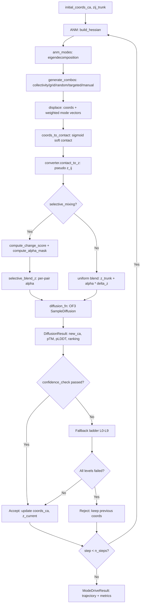

# ANM Mode-Drive Pipeline: Derinlemesine Teknik Dokuman

> Bu dokuman, ANM-OpenFold3 Mode-Drive pipeline'inin tum katmanlarini, tensor akislarini ve karar mekanizmalarini detayli olarak aciklar.

---

## 1. Genel Bakis

Pipeline'in amaci: bir proteinin baslangic yapisinden (CA koordinatlari) hareketle, ANM normal mod deplasmanlarini OF3 diffusion modulu ile birlestirerek fiziksel olarak anlamli konformasyonel ensemble'lar uretmek.

**Yuksek seviye akis:**

```
coords_ca -> ANM Hessian -> eigendecomposition -> mod kombinasyonu ->
displace -> contact map -> z_pseudo -> blend z_trunk -> diffusion -> new_ca -> repeat
```

**Strateji (hedef: baslangic yapisindan maksimum uzaklasma):**
1. ANM modlarini hesapla, collectivity'ye gore sirala
2. En kolektif kombinasyonu `df_min` ile dene
3. RMSD artmiyorsa bir sonraki kombinasyona gec
4. Tum kombinasyonlar tukendiyse `df`'yi `df_max`'a dogru escalate et
5. `n_steps` iterasyon calistir, confidence gating ile kalite kontrol yap



---

## 2. Tensor Boyutlari ve Akisi

Pipeline boyunca her adimda tensörlerin shape, dtype ve device bilgisi:

| Tensor | Shape | dtype | Device | Aciklama |
|--------|-------|-------|--------|----------|
| `coords_ca` | `[N, 3]` | float32 | CPU/CUDA | CA atom pozisyonlari |
| `initial_coords_ca` | `[N, 3]` | float32 | CPU | Baslangic yapisi (referans) |
| `zij_trunk` | `[N, N, 128]` | float32/bfloat16 | CUDA | OF3 trunk pair representation |
| **Hessian** `H` | `[3N, 3N]` | float32 | CPU/CUDA | ANM Hessian matrisi |
| `eigenvalues` | `[n_modes]` | float32 | CPU/CUDA | Non-trivial ozdeğerler |
| `eigenvectors` | `[N, n_modes, 3]` | float32 | CPU/CUDA | Per-residue 3D displacement vectors |
| `b_factors` | `[N]` | float32 | CPU/CUDA | Per-residue B-faktorleri |
| `modes_sel` | `[N, k, 3]` | float32 | device(coords) | Secilen mod vektorleri |
| `dfs` | `[k]` | float32 | device(coords) | Displacement faktorleri |
| `displaced` | `[N, 3]` | float32 | CUDA | Displace edilmis koordinatlar |
| `contact` | `[N, N]` | float32 | CUDA | Sigmoid soft contact map |
| `z_pseudo` | `[N, N, 128]` | float32 | CUDA | Contact'tan inverse ile elde edilen pseudo z |
| `change_score` | `[N, N]` | float32 | CPU -> CUDA | Per-pair degisim skoru |
| `alpha_mask` | `[N, N]` | float32 | CUDA | Per-pair adaptive alpha |
| `z_mod` | `[N, N, 128]` | float32 | CUDA | Blend edilmis z (diffusion'a girdi) |
| `all_ca` | `[K, N, 3]` | float32 | CUDA | K sample'dan tum CA'lar |
| `best_ca` / `new_ca` | `[N, 3]` | float32 | CPU | En iyi sample'in CA'lari |
| `plddt` | `[K, N]` | float32 | CPU | Per-sample per-residue pLDDT |
| `ptm` | `[K]` | float32 | CPU | Per-sample pTM |
| `ranking` | `[K]` | float32 | CPU | Per-sample ranking score |
| `pae` | `[N, N]` | float32 | CPU | PAE matrisi (best sample) |
| `contact_probs` | `[N, N]` | float32 | CPU | OF3 distogram contact probs |

**Device akisi ozet:**
- Eigendecomposition: `float64` + `CPU` (numerik stabilite icin)
- Contact/blend/diffusion: `CUDA`
- Sonuc (new_ca): `CPU`'ya geri tasinir (`.to(initial_coords_ca.device)`)

---

## 3. ANM Modlari

### 3.1 Hessian Hesabi (`build_hessian`)

```python
# coords: [N, 3] -> H: [3N, 3N]
diff = coords.unsqueeze(0) - coords.unsqueeze(1)  # [N, N, 3]
dist = diff.norm(dim=-1)                            # [N, N]
w = torch.sigmoid(-(dist - cutoff) / tau)           # [N, N] soft contact
e = diff / (dist.unsqueeze(-1) + 1e-8)             # [N, N, 3] unit vectors
outer = e.unsqueeze(-1) * e.unsqueeze(-2)          # [N, N, 3, 3]
H_blocks = -gamma * w[..., None, None] * outer     # [N, N, 3, 3]
```

Off-diagonal 3x3 blok: `H_ij = -gamma * w_ij * (e_ij . e_ij^T)`
Diagonal 3x3 blok: `H_ii = -sum_{j!=i} H_ij`

Parametreler:
- `anm_cutoff = 15.0 A` (varsayilan)
- `anm_gamma = 1.0` (uniform spring constant)
- `anm_tau = 1.0` (sigmoid sicakligi)

### 3.2 Eigendecomposition (`anm_modes`)

```python
H64 = hessian.to(dtype=torch.float64, device="cpu")
vals, vecs = torch.linalg.eigh(H64)
# Ilk 6 trivial mod (3 translation + 3 rotation) atlanir
eig_vals = vals[6 : 6 + k]       # [k]
eig_vecs = vecs[:, 6 : 6 + k]    # [3N, k] -> reshape -> [N, k, 3]
```

### 3.3 Displacement

```python
# Eigenvalue-weighted displacement
amp = 1.0 / (eigenvalues.sqrt() + 1e-10)  # low-freq -> larger amplitude
amp = amp / (amp.sum() + 1e-10)            # normalize
weights = dfs * amp                         # [n_sel]
displacement = (mode_vectors * weights[None, :, None]).sum(dim=1)  # [N, 3]
new_coords = coords + displacement
```

### 3.4 Kombinator Stratejileri

| Strateji | Yontem | Kullanim |
|----------|--------|----------|
| `collectivity` | Mod kombinasyonlarini collectivity'ye gore siralar, df escalation | Varsayilan, exploration odakli |
| `grid` | select_modes x df_range grid search | Sistematik tarama |
| `random` | Rastgele mod secimi, df_scale ile olcekleme | Monte Carlo tarzinda |
| `targeted` | Target koordinatlarina yonelimli mod secimi | Bilinen hedef yapisi varsa |
| `manual` | Kullanicinin sectigi modlar | Spesifik mod analizi |
| `autostop` | IW-ENM MD + early-stop picker (ANM mode-combo bypass) | Fiziksel MD tabanli |

**Collectivity hesabi:**
```python
kappa_k = (1/N) * exp(-sum_i u^2_ki * ln(u^2_ki))
# u^2_ki = ||v_k_i||^2 / sum_j ||v_k_j||^2
```
1/N (lokalize) ile 1.0 (maksimum kolektif) arasi deger alir.

---

## 4. Displacement -> Contact -> Z-pair

### 4.1 coords_to_contact (Sigmoid Soft Contact)

```python
def coords_to_contact(coords, r_cut=10.0, tau=1.5):
    dist = torch.cdist(coords.unsqueeze(0), coords.unsqueeze(0)).squeeze(0)  # [N, N]
    c = torch.sigmoid(-(dist - r_cut) / tau)  # [N, N]
    c.fill_diagonal_(0.0)
    return c
```

**Formul:** `C_ij = sigma(-(d_ij - r_cut) / tau)`, `C_ii = 0`

- `r_cut = 10.0 A`: Cutoff merkezi
- `tau = 1.5`: Sigmoid sicakligi (kucuk tau -> keskin geçis)
- Sonuc: `[N, N]` simetrik matris, degerler [0, 1] araliginda

### 4.2 PairContactConverter (Forward/Inverse)

**Forward:** `z_to_contact(z)`: `[N, N, 128]` -> ContactProjectionHead -> `[N, N]`
**Inverse:** `contact_to_z(c)`: `[N, N]` -> head.inverse() -> `[N, N, 128]`

```python
# Pipeline icinde kullanim:
contact = coords_to_contact(displaced, cfg.contact_r_cut, cfg.contact_tau)  # [N, N]
z_pseudo = self.converter.contact_to_z(contact)                              # [N, N, 128]
z_pseudo = z_pseudo.to(target_device)                                        # CUDA'ya tasi
```

---

## 5. Selective Mixing (alpha_mask)

Selective mixing, uniform alpha yerine her (i,j) pair'ine farkli alpha uygular. Cok hareket eden bolgeler daha fazla z_pseudo sinyali alir; statik bolgeler trunk'i korur.

### 5.1 Change Score Hesabi

```python
def compute_change_score(coords_before, coords_after, initial_coords,
                         r_cut, tau, w_c=0.5, w_d=0.5, distance_mode="max"):
```

Iki sinyal birlestirilir:

1. **delta_C** (topolojik degisim): `|C_after - C_before|` -> normalize -> `[0, 1]`
2. **D_ij** (konformasyonel degisim): Per-residue displacement (Kabsch aligned), sonra pairwise `max(d_i, d_j)` veya `mean(d_i, d_j)` -> normalize -> `[0, 1]`

**Birlesim:** Weighted geometric mean: `S = delta_C_norm^w_c * D_norm^w_d`

Sonuc: `[N, N]` simetrik, diagonal = 0

### 5.2 Alpha Mask Hesabi

```python
def compute_alpha_mask(change_score, change_cutoff=0.15,
                       alpha_base=0.05, alpha_max=0.7, mapping="sigmoid"):
```

| Mapping | Formul |
|---------|--------|
| `linear` | `alpha = alpha_base + (alpha_max - alpha_base) * S_norm` |
| `sigmoid` | `t = sigmoid((S_norm - 0.5) * 10)`, sonra lineer map |
| `step` | Binary: `S < cutoff -> alpha_base`, aksi halde `alpha_max` |

- `change_cutoff = 0.15`: Bu esigin altindaki pair'ler `alpha_base` alir
- `alpha_base = 0.05`: Degismeyen pair'ler icin minimum alpha
- `alpha_max = 0.7`: Maksimum degisim gosteren pair'ler icin alpha

### 5.3 Blend Formulu

```python
def selective_blend_z(z_pseudo, z_trunk, alpha_mask, normalize=True,
                      direction="plus", diagonal_band=2):
    if normalize:
        z_pseudo = (z_pseudo - z_pseudo.mean()) / (z_pseudo.std() + 1e-8)
        z_pseudo = z_pseudo * z_trunk.std() + z_trunk.mean()

    delta_z = z_pseudo - z_trunk                    # [N, N, 128]
    alpha_expanded = mask.unsqueeze(-1)             # [N, N, 1]
    z_blended = z_trunk + alpha_expanded * delta_z  # [N, N, 128]
```

**Diagonal band korumasi:** `|i-j| <= diagonal_band` olan pozisyonlarda alpha = 0 (trunk korunur). Bu, backbone komsularinin lokal geometrisini korur.

---

## 6. OF3 Diffusion Entegrasyonu

### 6.1 Mimari

OF3 trunk BIR KEZ calistirilir ve cache'lenir:
- `si_input_cached`: Single input representation
- `si_trunk_cached`: Trunk single representation
- `zij_trunk_cached`: Trunk pair representation `[1, 1, N, N, 128]`

Her mode-drive adiminda SADECE diffusion sampling calisir:

```python
def diffusion_fn(z_mod: torch.Tensor) -> DiffusionResult:
    zij_modified = z_mod.unsqueeze(0).unsqueeze(0).to(device)  # [1, 1, N, N, 128]

    atom_positions = model.sample_diffusion(
        batch=cached_batch,
        si_input=si_input_cached,
        si_trunk=si_trunk_cached,
        zij_trunk=zij_modified,
        noise_schedule=noise_schedule,
        no_rollout_samples=K,
        use_conditioning=True,
    )
    # atom_positions -> CA extraction via start_atom_index
```

### 6.2 DiffusionResult

```python
@dataclass
class DiffusionResult:
    all_ca: torch.Tensor          # [K, N, 3]
    best_ca: torch.Tensor         # [N, 3] (ranking'e gore en iyi)
    best_idx: int
    plddt: torch.Tensor | None    # [K, N]
    ptm: torch.Tensor | None      # [K]
    ranking: torch.Tensor | None  # [K] = 0.8*pTM + 0.2*mean_pLDDT/100
    pae: torch.Tensor | None      # [N, N]
    contact_probs: torch.Tensor | None  # [N, N]
    has_clash: bool | None
    mean_pae: float | None
    consensus_score: float | None  # 1/(1 + mean_inter_sample_rmsd)
```

### 6.3 Confidence Metrics

- **pLDDT**: Per-residue local confidence (0-100). OF3 aux_heads tarafindan uretilir.
- **pTM**: Global fold benzerlik tahmini (0-1). Dikkat: trunk MSA'ya bagimli, yapi degistikce sistematik duser.
- **ranking_score**: `0.8 * pTM + 0.2 * mean_pLDDT/100`
- **PAE**: Predicted Aligned Error matrisi `[N, N]`
- **consensus_score**: K>1 icin inter-sample RMSD'nin tersi: `1/(1 + mean_RMSD)`

---

## 7. Pseudo-Diffusion (OF3'suz Test)

OF3 mevcut degilken test icin kullanilan pipeline:

```python
def make_pseudo_diffusion(converter, r_cut=10.0, tau=1.5, reference_coords=None):
    def _pseudo_diffuse(z_mod):
        # 1. z_mod -> contact (forward head)
        contact = converter.z_to_contact(z_mod)       # [N, N, 128] -> [N, N]

        # 2. contact -> distance (sigmoid inverse)
        dist = contact_to_distance(contact, r_cut, tau)  # [N, N]

        # 3. distance -> 3D coords (classical MDS)
        coords = classical_mds(dist, dim=3)              # [N, 3]

        # 4. Kabsch alignment (optional)
        if reference_coords is not None:
            coords, _ = kabsch_superimpose(reference_coords, coords)

        return coords
    return _pseudo_diffuse
```

### 7.1 contact_to_distance (Sigmoid Inverse)

```python
# d_ij = r_cut - tau * ln(C / (1 - C))
c = contact.clamp(1e-6, 1.0 - 1e-6)
logit = torch.log(c / (1.0 - c))    # sigmoid inverse (logit)
dist = r_cut - tau * logit
dist = dist.clamp(min=0.0)
```

### 7.2 Classical MDS

```python
D2 = dist_matrix ** 2                                          # [N, N]
H = torch.eye(N) - 1.0/N                                      # Centering matrix
B = -0.5 * H @ D2 @ H                                         # Double-centered
vals, vecs = torch.linalg.eigh(B.to(float64, device="cpu"))   # Eigendecompose
# Top 3 eigenvalues/vectors -> coords = vecs * sqrt(vals)
coords = top_vecs * top_vals.sqrt().unsqueeze(0)               # [N, 3]
```

### 7.3 Kabsch Alignment

```python
# 1. Center both structures
# 2. Covariance: H = mob_centered.T @ ref_centered  [3, 3]
# 3. SVD: U, S, Vt = svd(H)
# 4. Optimal rotation: R = Vt.T @ sign_matrix @ U.T
# 5. aligned = (mob_centered @ R.T) + ref_center
```

---

## 8. Confidence Gating

### 8.1 V1: Core Metrics (pTM/ranking)

```python
def _confidence_check(self, result, step_idx=0):
    # pTM cutoff (warmup-adjusted)
    if result.ptm < ptm_cut:       return False, f"pTM={result.ptm}<{ptm_cut}"

    # pLDDT cutoff
    if mean_plddt < cfg.confidence_plddt_cutoff:  return False, ...

    # Ranking gate (composite veya eski)
    if cfg.use_composite_gate:
        gate_score = self._compute_gate_score(result)
        if gate_score < cfg.composite_gate_threshold:  return False, ...
    elif result.ranking_score < rank_cut:              return False, ...
```

### 8.2 Composite Gate (Data-Driven, 708 Step Korelasyon Analizi)

```python
# TM_tgt ile korelasyon:
#   cR    r=+0.598 -> w=0.45 (en guclu pozitif sinyal)
#   pLDDT r=+0.271 -> w=0.30
#   Rg    r=+0.061 -> w=0.15 (fiziksel saglamlik)
#   pTM   r=-0.236 -> w=0.10 (TERS korelasyon!)

gate_score = (
    0.45 * n_cr      +   # cR: [0.85, 1.0] -> [0, 1]
    0.30 * n_plddt   +   # pLDDT: [60, 90] -> [0, 1]
    0.15 * n_rg      +   # Rg: quadratic penalty from 1.0
    0.10 * n_ptm         # pTM: [0, 0.8] -> [0, 1]
)
# Threshold: 0.55
```

**Onemli insight:** OF3 pTM trunk MSA'ya bagimli -- yapi degistikce sistematik duser. cR ve pLDDT intrinsic kaliteyi olcer, baslangica bagimli degil.

### 8.3 V2: Fiziksel Filtreler

| Metrik | Cutoff | Anlam |
|--------|--------|-------|
| `rg_ratio` | `< 0.3` veya `> 2.5` | Yapi asiri sikismis veya patlamis |
| `rmsd_init_max` | `> 10.0 A` | Yapi kurtarilamaz (V3 analiz) |
| `has_clash` | `True` | OF3 clash detection |
| `mean_pae` | `> cutoff` (optional) | Predicted aligned error |
| `contact_recon` | `< cutoff` (optional) | Contact reconstruction korelasyonu |
| `consensus_score` | `< cutoff` (optional) | Inter-sample agreement |

### 8.4 Warmup

Ilk N step'te cutoff'lar gevsetilir:
- `confidence_warmup_steps = 0` (default disabled)
- `confidence_warmup_ptm_cutoff = 0.25`
- `confidence_warmup_ranking_cutoff = 0.35`

---

## 9. Fallback Mekanizmasi

### 9.1 ANM Mode-Combo Fallback (step_with_fallback)

| Level | Eylem | Aciklama |
|-------|-------|----------|
| L0 | Normal step | En iyi combo by RMSD/collectivity |
| L1 | Sonraki N combo | `fallback_combo_tries=3` combo daha dene |
| L2 | df azalt | `df *= fallback_df_factor (0.5)` |
| L3 | Single mode | `max_combo_size = 1` |
| L4 | alpha azalt | `alpha *= fallback_alpha_factor (0.5)` |
| L5 | Extended grid | combo x df x alpha (10 combo, df:[0.5, 0.25], alpha:[0.5, 0.25]) |
| -- | Forced accept | Tum level'lar basarisiz -> en yuksek ranking sonucu `rejected=True` ile don |

### 9.2 Autostop Fallback Ladder (L0-L9)

| Level | Eylem | MD Re-run? |
|-------|-------|:---:|
| L0 | Baseline autostop | Evet |
| L1 | pick_fractions (progressively earlier frames) | Hayir (replay) |
| L2 | v_magnitude scales | Evet |
| L3 | eps_E/eps_N scales | Hayir (replay) |
| L4 | z_alpha scales | Hayir |
| L5 | patience deltas | Hayir (replay) |
| L6 | smooth_w deltas | Hayir (replay) |
| L7 | Grid (v x back_off x alpha) | Evet (capped) |
| L8 | Grid (eps_E x eps_N x patience x smooth_w) | Hayir (capped) |
| L9 | Forced-accept best-so-far | - |

Varsayilan aktif level'lar: `(0, 1, 4, 9)` -- L2/L7 pahali (MD rerun).

**Rg guard:** Her level'da `rg_ratio > confidence_rg_max` olan sonuclar candidate pool'dan cikarilir.
**rmsd_init guard:** `rmsd > confidence_rmsd_init_max` olan sonuclar da reddedilir.

---

## 10. Early Stopping

### 10.1 TM-Based Adaptive Stopping

```python
# Accepted step'lerin TM degerleri takip edilir
accepted_tm_history.append(current_tm)

# Son W+1 deger icinde monoton azalis kontrolu
w = cfg.adaptive_stop_window  # default: 3
recent = accepted_tm_history[-(w + 1):]
monoton_azalis = all(recent[i] > recent[i+1] for i in range(len(recent)-1))
if monoton_azalis:
    # En iyi yapiyi dondup pipeline'i durdur
    result.trajectory.append(coords_best.clone())
    break
```

### 10.2 Best-so-far Rollback

```python
# Mevcut TM, best'ten %40+ dusukse geri don
if current_tm < tm_best * (1.0 - cfg.best_rollback_tm_drop):
    coords_ca = coords_best.clone()
    z_current = z_best.clone()
```

### 10.3 Consecutive Rejection Stop

```python
if consecutive_rejected >= cfg.max_consecutive_rejected:
    break  # Pipeline stalled
```

### 10.4 Alpha Decay (Stall Prevention)

```python
# Her rejected step'ten sonra alpha kucultulur
cfg.z_mixing_alpha = max(0.02, cfg.z_mixing_alpha * cfg.rejected_alpha_decay)
# Basarili step'te restore edilir
```

---

## 11. Device Yonetimi

### 11.1 CPU vs CUDA Tensor Akisi

| Islem | Device | Neden |
|-------|--------|-------|
| Eigendecomposition (`torch.linalg.eigh`) | CPU + float64 | Numerik stabilite |
| Hessian build | coords'un device'i | Input'a bagli |
| `coords_to_contact` | CUDA | Hizli matris islemleri |
| `converter.contact_to_z` | converter.device (CPU/CUDA) | Model weights |
| z blending | CUDA | zij_trunk CUDA'da |
| Diffusion (`sample_diffusion`) | CUDA | GPU zorunlu |
| Sonuc storage (StepResult) | CPU | Memory ve serialization |
| Change score hesabi | coords'un device'i | Sonra `.to(z_pseudo.device)` |

### 11.2 Kritik `.to()` Cagrilari

```python
# _downstream_from_displaced icinde:
displaced = displaced.to(target_device)           # CUDA'ya
initial_coords_ca = initial_coords_ca.to(target_device)
z_pseudo = z_pseudo.to(target_device)             # converter CPU ise
alpha_mask = alpha_mask.to(z_pseudo.device)       # coords CPU olabilir

# diffusion_fn icinde:
zij_modified = z_mod.unsqueeze(0).unsqueeze(0).to(device)  # [1, 1, N, N, 128] CUDA

# Sonuclarda:
new_ca = new_ca.to(initial_coords_ca.device)      # CPU'ya geri
displaced_ca=displaced.cpu()
contact_map=contact.cpu()
```

### 11.3 Eigendecomposition Ozel Durumu

```python
# anm_modes icinde:
H64 = hessian.to(dtype=torch.float64, device="cpu")  # Stabilite icin CPU+fp64
vals, vecs = torch.linalg.eigh(H64)
vals = vals.to(dtype=orig_dtype, device=device)       # Orijinal device'a geri
vecs = vecs.to(dtype=orig_dtype, device=device)
```

Ayni pattern `classical_mds` icin de gecerli:
```python
B64 = B.to(dtype=torch.float64, device="cpu")
vals, vecs = torch.linalg.eigh(B64)
# Geri donusturup orijinal device'a tasi
```

---

## Ilgili Dokumanlar

- [[09-anm-mode-drive]] - ANM Mode-Drive overview
- [[11-pipeline-mathematics]] - Matematiksel detaylar
- [[13-confidence-guided-pipeline]] - Confidence gating detaylari
- [[14-selective-mixing-pipeline]] - Selective mixing detaylari
- [[08-anm-theory]] - ANM teori

---

## Kaynak Dosyalar

| Dosya | Icerik |
|-------|--------|
| `src/mode_drive.py` | Ana pipeline sinifi (`ModeDrivePipeline`) |
| `src/mode_drive_config.py` | Config, StepResult, ModeDriveResult dataclass'lari |
| `src/mode_drive_utils.py` | Kabsch, RMSD, TM-score, MDS, pseudo-diffusion |
| `src/anm.py` | Hessian, eigendecomposition, displacement, collectivity |
| `src/coords_to_contact.py` | Sigmoid soft contact map |
| `src/converter.py` | PairContactConverter (z <-> contact bidirectional) |
| `src/selective_mixing.py` | Per-pair adaptive alpha hesabi ve blend |
| `src/of3_diffusion.py` | OF3 diffusion wrapper, DiffusionResult |
| `src/mode_combinator.py` | Mod kombinasyon stratejileri |
| `src/composite_confidence.py` | Data-driven composite gate skoru |
