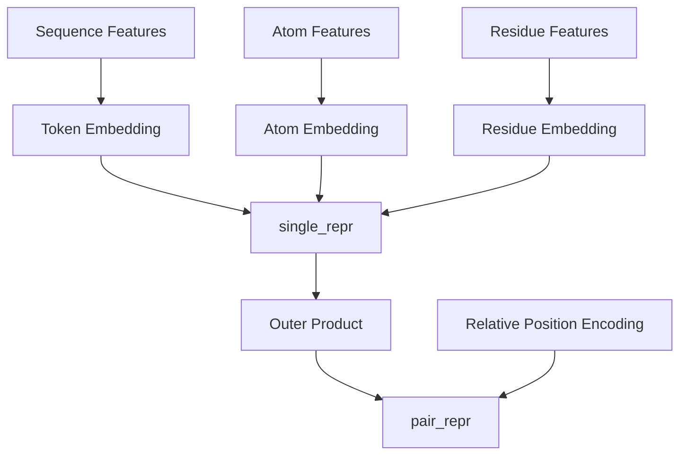

# Input Embedder

## Kaynak
`openfold3/core/model/feature_embedders/input_embedders.py` (21.5 KB)

## Sınıf: InputEmbedderAllAtom

Raw input features'ları model representation'larına dönüştürür.

### Girdi
- Sequence features (amino acid, nucleotide types)
- Atom features (element types, charges)
- Residue features (position, chain info)
- Bond features (connectivity)

### Çıktı
- `single_repr` [B, N_tokens, d_single]
- `pair_repr` [B, N_tokens, N_tokens, d_pair]

### İşlem Akışı

## Related
- [[../architecture/02-model-architecture]] - Model genel bakış
- [[msa-module]] - Sonraki aşama

#openfold3 #module #embedding
