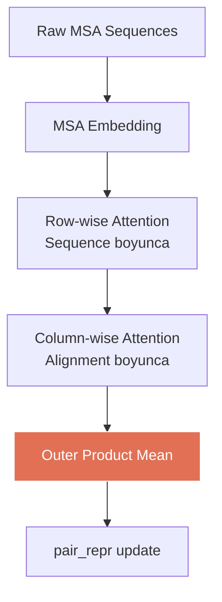

# MSA Module

## Kaynak
`openfold3/core/model/latent/msa_module.py` (13.7 KB)

## Sınıf: MSAModuleStack

Multiple Sequence Alignment (MSA) bilgisini pair representation'a entegre eder.

### Amaç
Evrimsel bilgiyi (hangi pozisyonlar birlikte mutasyon geçirmiş - coevolution) yapısal tahmine aktarmak.

### İşlem Akışı



### Key Operation: Outer Product Mean
MSA representation'dan pair representation'a bilgi transferi:
```
pair_repr += OuterProductMean(msa_repr)
# msa_repr: [B, N_msa, N_tokens, d_msa]
# output:   [B, N_tokens, N_tokens, d_pair]
```

## Related
- [[input-embedder]] - Önceki aşama
- [[pairformer]] - Sonraki aşama
- [[../architecture/02-model-architecture]] - Model overview

#openfold3 #module #msa #evolution
