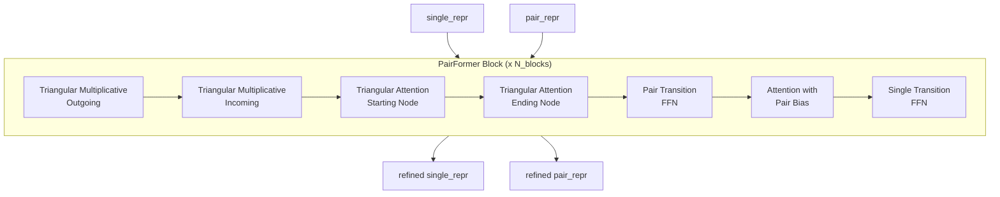
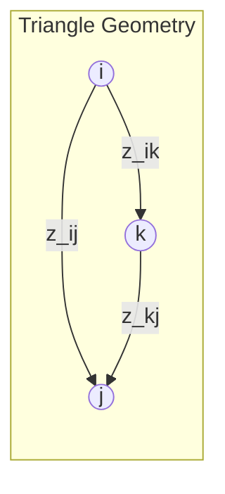

# PairFormer

## Kaynak
`openfold3/core/model/latent/pairformer.py` (17 KB)

## Sınıf: PairFormerStack

Pair representation'ı iteratif olarak refine eden transformer stack.

### Neden Önemli
AlphaFold3'ün temel yeniliği: Evoformer yerine PairFormer kullanımı. Pair representation üzerinden yapısal bilgiyi daha etkin işler.

### İşlem Akışı

### Triangular Updates

- **Outgoing**: i → k → j path üzerinden z_ij güncelleme
- **Incoming**: k → i, k → j path üzerinden z_ij güncelleme
- Üçgen geometri constraint'i yapısal tutarlılık sağlar

## Related
- [[msa-module]] - Önceki aşama
- [[diffusion-module]] - Sonraki aşama
- [[../architecture/02-model-architecture]] - Model overview

#openfold3 #module #pairformer #transformer
