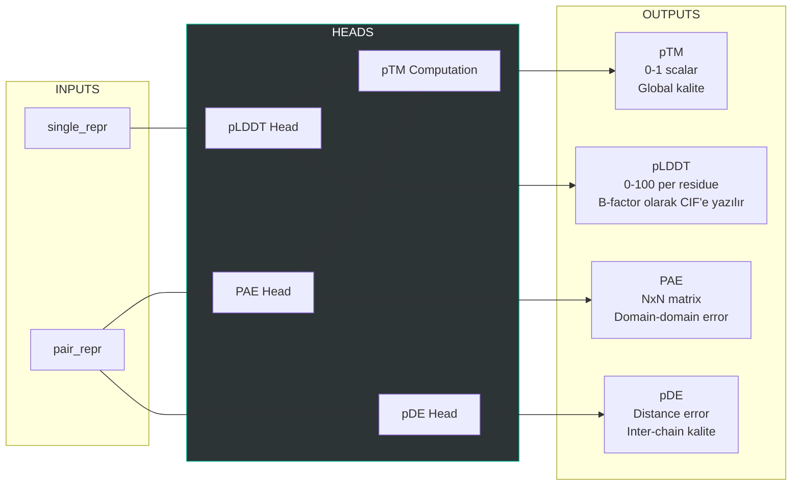
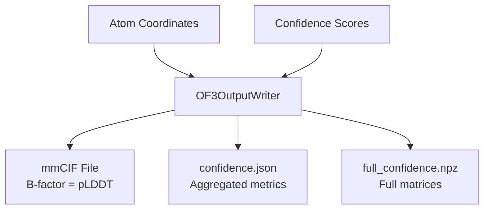

# Prediction Heads

## Kaynak
- `openfold3/core/model/heads/prediction_heads.py` (21.3 KB)
- `openfold3/core/model/heads/head_modules.py` (9.8 KB)

## Sınıf: AuxiliaryHeadsAllAtom

Yapı kalitesi ve güvenilirlik metriklerini hesaplar.

### Confidence Metrikleri

### pLDDT (predicted Local Distance Difference Test)

| Aralık | Yorum |
|--------|-------|
| > 90 | Çok yüksek güven - iyi yapılanmış bölge |
| 70-90 | Güvenilir - genel fold doğru |
| 50-70 | Düşük güven - esnek loop/disordered bölge olabilir |
| < 50 | Çok düşük - muhtemelen disordered |

**ANM ile ilişki**: Düşük pLDDT bölgeleri genelde yüksek ANM flexibility gösterir.

### PAE (Predicted Aligned Error)

NxN matris: residue i'nin residue j'ye göre tahmin hatası.
- Düşük PAE bloğu → aynı rigid domain
- Yüksek PAE → farklı domain veya esnek bağlantı

**ANM ile ilişki**: PAE block yapısı, ANM'den çıkan dynamic domain sınırlarıyla karşılaştırılabilir.

### pDE (Predicted Distance Error)
- Özellikle inter-chain mesafe tahmin hatası
- Ligand binding kalitesi için önemli

### pTM (predicted Template Modeling Score)
- Global yapı kalitesi (0-1)
- > 0.5: iyi fold tahmini
- > 0.8: yüksek kaliteli tahmin

## Output Writer

## Related
- [[diffusion-module]] - Önceki aşama
- [[../architecture/01-openfold3-inference-pipeline]] - Pipeline
- [[../architecture/03-data-flow]] - Data flow

#openfold3 #module #confidence #plddt #pae
